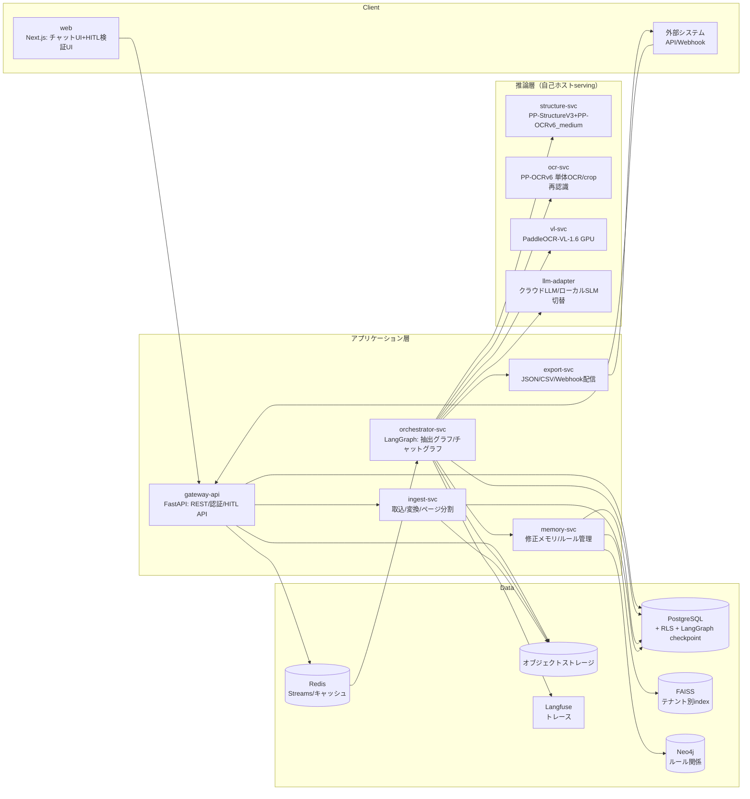
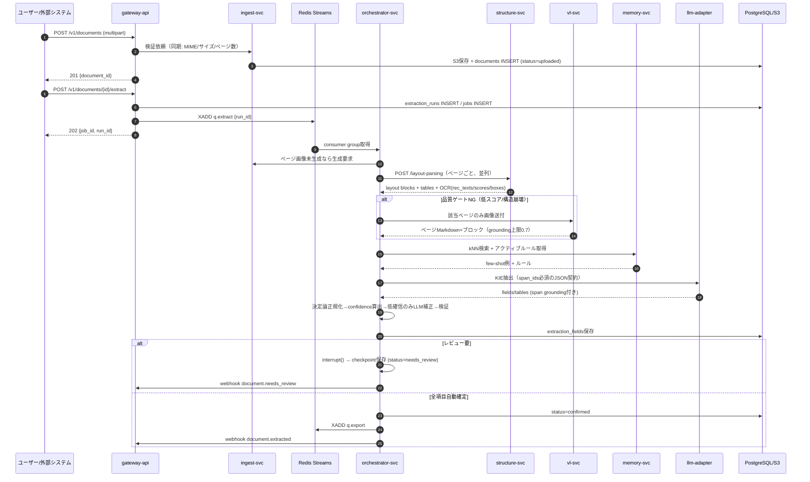
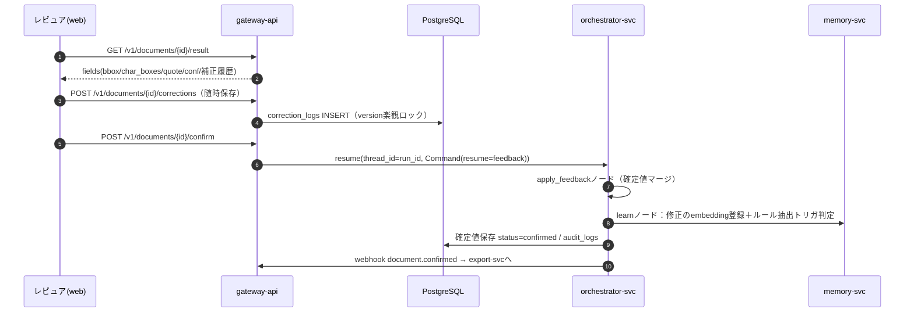
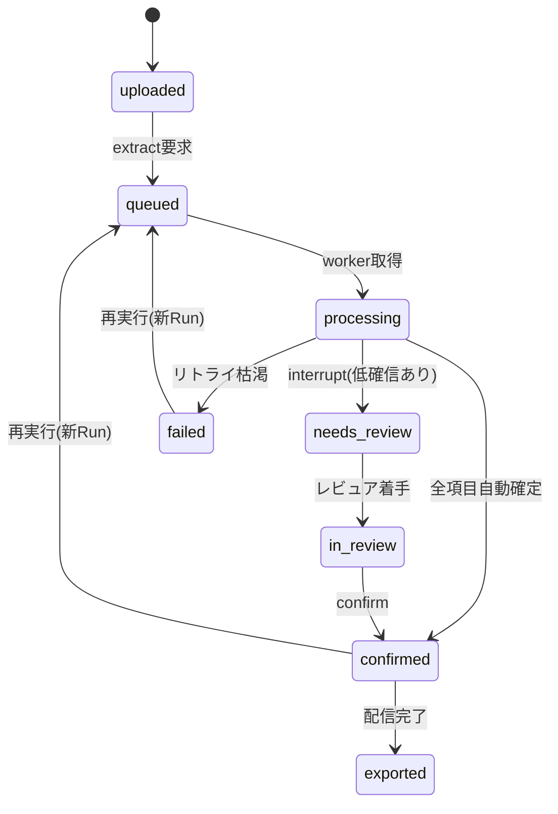
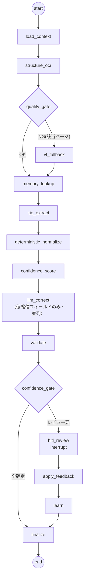
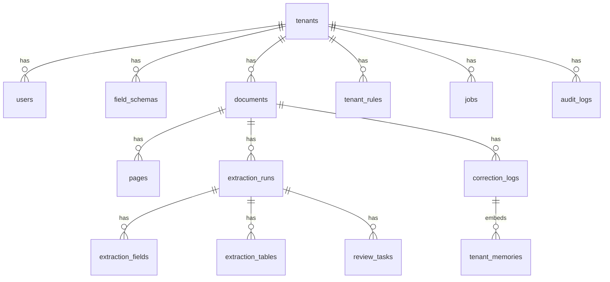
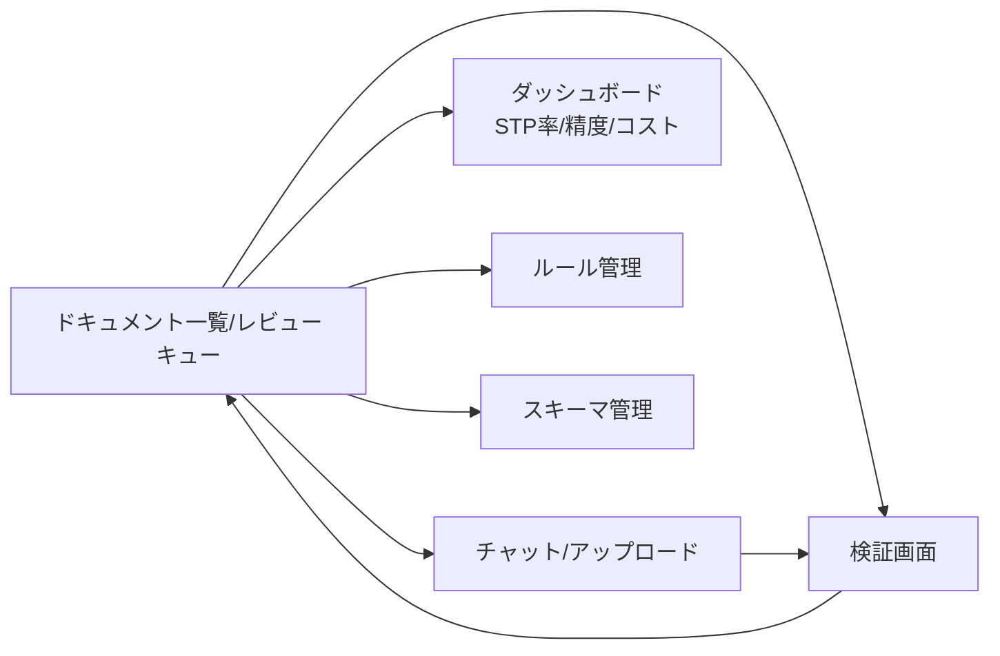

# 次世代AI-OCRエージェント 詳細設計書 v1.0

| 項目 | 内容 |
|---|---|
| 文書バージョン | 詳細設計 v1.2（2026-07-14 改訂：本番プラットフォームを EKS→ECS に変更〔§2.3／§13.3、DD-14〕、GPUゼロ start／VL段階導入を採用〔DD-15〕、DD-01 を ingest 側前処理に改訂。実装リポジトリの ADR-0002／0003 と同期）<br>旧：v1.1（§8.6 検証モード、§16 ワークフロー自動化・エージェント設定、DD-11〜13 を追加） |
| 準拠文書 | 技術設計書 v2.0（PP-OCRv6/PaddleOCR 3.7ベース、2026-07-14） |
| 作成日 | 2026-07-14 |
| 想定読者 | 株式会社NewFan 社内開発チーム（バックエンド／フロントエンド／ML／SRE） |
| 位置づけ | 基本設計（技術設計書v2.0）で確定したアーキテクチャ・技術選定を、実装着手可能な粒度（サービス分割、シーケンス、API仕様、DDL、エージェントのState/ノード/プロンプト、画面仕様、運用設計）まで展開する |

---

## 目次

1. はじめに（前提・用語・設計判断記録）
2. システム構成詳細
3. 処理シーケンス詳細・状態遷移
4. エージェント詳細設計（LangGraph）
5. モジュール別詳細設計
6. API詳細仕様
7. データベース詳細設計（DDL）
8. HITL検証UI詳細設計
9. 非同期ジョブ・キュー設計
10. エラーハンドリング設計
11. セキュリティ・マルチテナント詳細設計
12. 可観測性・運用設計
13. 性能設計・キャパシティプランニング
14. テスト設計
15. リポジトリ構成・開発規約
16. ワークフロー自動化・AIエージェント設定
17. 付録（設定値一覧／混同文字表／実装時要確認リスト）

---

# 1. はじめに

## 1.1 本書の目的とスコープ

本書は、テンプレートレスAI-OCRエージェントサービス（以下「本システム」）のMVPフェーズ実装に必要な詳細設計を定義する。スコープは技術設計書v2.0の §4〜§13 に対応する全コンポーネント。PoCで検証済みとする前提項目（confidence閾値の初期値等）は「仮置き」と明記し、PoC実測値で置換する。

## 1.2 前提条件

- OCRエンジン：PaddleOCR 3.7 系（PP-OCRv6_medium を本番標準。PP-StructureV3、PaddleOCR-VL-1.6、PP-ChatOCRv4）。ライセンスはApache-2.0。
- 対象帳票：日本語ビジネス帳票（請求書・納品書・注文書）。手書きはMVPでは精度保証外（HITL必須扱い）。
- デプロイ形態：SaaS（AWS想定）を主、CPUオンリー・オンプレ（軽量版）を将来オプション。本書はSaaS構成を正とし、オンプレ差分は §2.6 に記載。
- エージェント基盤：LangGraph（Python）。チェックポイントはPostgreSQL。
- 言語・ランタイム：バックエンド Python 3.12（FastAPI）、フロントエンド TypeScript（Next.js 15 / React 19）。

## 1.3 用語定義

| 用語 | 定義 |
|---|---|
| Run（抽出ラン） | 1ドキュメントに対する1回の抽出パイプライン実行。再実行のたびに新しいRunを発行 |
| スパン（span） | OCRが返す行単位のテキスト＋bbox＋confidence。単文字座標（char_boxes）を持ちうる |
| grounding | 抽出値と帳票画像上の根拠（span/bbox/原文quote）の対応付け |
| STP | Straight-Through Processing。人手レビューなしで自動確定した割合 |
| 決定論チェック | LLMを使わない検算・形式検証（合計整合、チェックディジット等） |
| 修正メモリ | テナント別に蓄積されたユーザー修正のembeddingインデックス（few-shot注入用） |
| テナントルール | 修正ログからLLMが抽出し検証を通過した明示的ルール（正規表現置換・形式・語彙マップ等） |
| critical field | 誤りの業務影響が大きいフィールド（合計金額・口座・登録番号・支払期日等）。閾値・レビュー方針が厳格 |

## 1.4 設計判断記録（Design Decisions）

実装中の迷いを防ぐため、基本設計から一段掘り下げた判断を記録する。変更する場合は本表を更新すること。

| ID | 判断 | 内容と理由 | 再検討条件 |
|---|---|---|---|
| DD-01 | ビューア画像＝前処理後画像（前処理はingest側で実施） | OCR座標系と表示座標系を一致させるため、HITLビューアには「座標系の正」となる前処理後ページ画像を表示する。**PP-StructureV3サービングの `/layout-parsing` 応答にはクリーンな前処理後画像が含まれない**（outputImagesはオーバーレイ入り可視化、inputImageは原画、docPreprocessingImageは `/ocr` 側フィールド）ことが判明したため、前処理（向き補正・アンワープ）を **ingest-svc 側で実施**し、その PNG を `pages.image_uri`（座標系の正）とする。structure/ocr サービングは前処理オフ（`use_doc_orientation_classify=false`／`use_doc_unwarping=false`）で呼ぶ。原本は別途DL可能にする（詳細: ADR-0002） | 前処理で判読性が落ちる帳票が多発した場合 |
| DD-02 | 主経路はPP-StructureV3の単一呼出し | OCRとレイアウト解析を別々に呼ぶとOCRが二重実行になるため、PP-StructureV3（内部OCRをPP-OCRv6に固定）を主経路とし、1回の呼出しでレイアウト＋表＋OCR結果を得る。単文字座標が応答に含まれない場合のみ、低確信スパンをcrop単位で `/ocr` に再問い合わせするハイブリッドとする | 応答スキーマ確認の結果、必要情報が欠落する場合 |
| DD-03 | サブモデルの明示固定 | PP-StructureV3のOCRサブモジュールは `PP-OCRv6_medium_det` / `PP-OCRv6_medium_rec` を設定で明示指定する（3.7時点のデフォルトに依存しない）。数式認識・図表解析は帳票用途では無効化し高速化 | — |
| DD-04 | KIEの主方式は汎用LLM＋span grounding | PP-ChatOCRv4と汎用LLM直呼びをPoCでA/B比較し、MVPでは制御性（span_ids必須出力・スキーマ制約）に優れる汎用LLM方式を主とする。ChatOCRv4はベンチ比較対象として保持 | A/Bで ChatOCRv4 が field-level +2pt以上優位の場合 |
| DD-05 | キューはRedis Streams | SaaS/オンプレ両対応のためqueueインターフェースを抽象化し、既定実装をRedis Streams、AWS本番はSQS切替可能とする | 運用負荷・スループット要件 |
| DD-06 | embeddingはローカルモデル | 修正メモリのembeddingは `intfloat/multilingual-e5-small`（384次元）をローカル推論。顧客修正データを外部APIへ出さないため | 日本語検索品質が不足する場合（日本語特化モデルへ差替え） |
| DD-07 | ベクタ検索はFAISS | チーム経験と分離容易性からテナント別FAISSインデックス。正本はPostgreSQLのcorrection_logsとし、インデックスは常に再構築可能な派生物とする | 運用簡素化のためpgvectorへ寄せる判断をする場合 |
| DD-08 | tiny档の使用禁止（日本語） | PP-OCRv6_tinyは日本語非対応（49言語）。日本語テナントのパイプライン設定でtinyを指定した場合、起動時バリデーションでエラーとする | — |
| DD-09 | VLフォールバック結果は自動確定禁止 | PaddleOCR-VL-1.6由来のフィールドは grounding_score 上限0.7とし、必ずレビューキューへ | VLの捏造率が自社ベンチで十分低いと実証された場合 |
| DD-10 | LLM補正の適用制約 | LLMによる自動置換は「混同文字表の組合せ」または「テナント修正メモリの類似例に合致」する場合のみ。それ以外の変更提案は needs_review 扱い（自動適用しない） | — |
| DD-11 | ワークフローは粗粒度ブロックの合成 | ユーザー定義ワークフロー（§16）で構成できるのはトリガー/処理/分岐/変換/出力の粗粒度ノードのみ。抽出グラフ（§4）の内部ノード構成は変更不可。品質保証・監査の境界を固定するため | 内部構成に踏み込むノード要望が継続する場合 |
| DD-12 | 出力コネクタは許可リスト＋dry-run必須 | DB格納はINSERT/UPSERTのみ（UPDATE/DELETE不可）。書込み先はconnection単位の許可テーブルリストに限定し、ワークフロー有効化にはdry-run成功を必須とする | — |
| DD-13 | 監視取込の冪等性 | フォルダ/メール監視は source_cursors（パス＋コンテンツハッシュ/etag）で処理済み管理し、同一ファイルは既定skip（明示的な再処理のみ許可） | — |
| DD-14 | 本番プラットフォームはECS（Fargate中心） | EKSは運用・実装コストが大きいため、本番を **Amazon ECS** とする。CPU系は **Fargate**（サーバレス）、GPUが必須のコンポーネントのみ **ECS on EC2（GPU）**。K8s機能は Service Auto Scaling／Service Connect／ALB+WAF／Secrets Manager・SSM・ECR に置換（§2.3／§13.3、詳細: ADR-0003） | GPUスループット要件や運用体制が大きく変化した場合 |
| DD-15 | GPUゼロ start・VLは段階導入 | コスト最小化のためFargateはGPU非対応である点を踏まえ、既定（Option A）では主経路 structure/ocr を **OpenVINO CPU で Fargate** に載せ、**vl-svc は当面無効**（品質ゲートNGページは HITL 直行、§10のVL縮退と同経路）とし GPU を完全回避する。難読帳票の精度が要件に届かない場合に限り Option B（vl-svc を ECS-EC2-GPU で追加、必要なら structure/ocr もGPU化）へ段階拡張する。CPU/GPU・VL有無の切替は設定で吸収し、コード分岐を持たない（§2.6方針） | 難読帳票の精度が要件未達、またはVLの費用対効果が見合う場合 |

---

# 2. システム構成詳細

## 2.1 サービス分割



| サービス | 役割 | 技術 | スケール単位 |
|---|---|---|---|
| gateway-api | REST API、認証認可、HITL用API、Webhook受付、SSEチャット中継 | FastAPI + uvicorn | HPA（CPU） |
| ingest-svc | ファイル検証、S3保存、PDF/TIFFページ分割、Office→PDF変換、ページ画像生成 | Python（pypdfium2、libtiff、LibreOffice headless） | キュー深度 |
| orchestrator-svc | LangGraph実行（抽出グラフ／チャットグラフ）、interrupt/resume、KIE・補正・検証ノード | Python + LangGraph | キュー深度 |
| structure-svc | PP-StructureV3サービング（内部OCR=PP-OCRv6_medium固定）。レイアウト・表・OCRを単一応答で返す | PaddleOCR公式高安定性サービングDockerを基に構成固定 | GPU（A10）またはCPU（OpenVINO） |
| ocr-svc | PP-OCRv6単体（crop再認識・単文字座標取得・small档による照合用） | 同上 | 同上 |
| vl-svc | PaddleOCR-VL-1.6（難読ページフォールバック専用） | 公式サービング | GPU専用プール |
| llm-adapter | LLM/SLMの抽象化（プロバイダ切替、ZDR設定、リトライ、コスト計測） | Python（litellm等） | HPA |
| memory-svc | 修正メモリ検索/登録、ルール抽出ジョブ、ルール検証 | Python + FAISS + Neo4jドライバ | 常駐（テナントindexキャッシュ） |
| export-svc | 確定データのJSON/CSV生成、Webhook署名配信、外部連携 | Python | キュー深度 |
| web | チャットUI、HITL検証UI、ダッシュボード、ルール管理 | Next.js 15 | CDN+SSR |

## 2.2 バージョン固定（MVP時点）

| コンポーネント | バージョン／モデル | 備考 |
|---|---|---|
| paddleocr | 3.7.x | 3.7でPP-OCRv6が既定 |
| OCR検出/認識 | PP-OCRv6_medium_det / PP-OCRv6_medium_rec | DD-03。照合用にsmall_recを併載可 |
| レイアウト/表 | PP-StructureV3（formula/chart無効） | |
| VLフォールバック | PaddleOCR-VL-1.6 | 1.5と互換のため差替え容易 |
| LangGraph | 0.2系（interrupt/Command対応版） | checkpointer=PostgresSaver |
| LLM（既定） | クラウドLLM（構成で指定） | llm-adapterで抽象化。ZDRオプション |
| SLM（機密時） | 日本語SLM（ローカル） | vLLMサービング |
| embedding | intfloat/multilingual-e5-small（384d） | DD-06 |
| DB | PostgreSQL 16 | RLS使用 |
| キュー | Redis 7（Streams）／SQS切替 | DD-05 |

エンジン更新時は `pipeline_version`（§7 extraction_runs.engine_versions）を必ず更新し、§14の回帰ベンチを通過しない限り本番昇格しない。

## 2.3 ネットワーク・デプロイ構成（SaaS：Amazon ECS）

本番プラットフォームは **Amazon ECS**（DD-14／ADR-0003）。CPU系は Fargate、GPU必須の推論のみ ECS on EC2（GPU）。既定は GPUゼロ start（DD-15 Option A）。

- クラスタ／起動タイプ：
  - `newfan-app`（**Fargate**）：gateway/orchestrator/memory/export/ingest/web/llm-adapter。
  - `newfan-inference`（**Fargate, OpenVINO CPU**）：structure-svc/ocr-svc（Option A 既定）。
  - `newfan-gpu`（**ECS on EC2 GPU**：g5＋容量プロバイダ。Option B 拡張時のみ）：vl-svc（＋必要ならstructure/ocrのGPU版）。GPU-VL はメインスループット保護のため専用容量に分離。
- 内部通信：**ECS Service Connect**（Cloud Map 名前空間 `newfan.internal`）。推論・内部サービスは非公開。
- 外部公開：gateway-api と web のみ（**ALB + WAF**）。
- スケール分離：K8s のノードプール分離（general/gpu-ocr/gpu-vl）は **ECS クラスタ／容量プロバイダの分離**で実現。
- シークレット：**AWS Secrets Manager**（§16.5 secret_ref と整合）。設定：**SSM Parameter Store** / 環境変数（12-factor）。イメージ：**ECR**。
- 画像・帳票はS3（SSE-KMS）。パス規約：`s3://{bucket}/{tenant_id}/{document_id}/original.{ext}`、`.../pages/{page_no}.png`（前処理後）、`.../derived/...`。
- データ層：PostgreSQL は **RDS**、Redis は **ElastiCache**（キューは SQS 切替可、DD-05）、いずれもマネージド。memory-svc の FAISS スナップショットは **EFS**（正本は RDS、index は再構築可、DD-07）。
- ローカル/CI は `deploy/compose.yaml`（コンテナベース）を継続し、ECS タスク定義のローカルプロキシとする（1 service = 1 task definition）。

## 2.4 構成管理・設定

- 全サービス12-factor。設定は環境変数＋テナント設定（tenants.settings JSONB）。
- 閾値・混同文字表・プロンプトは「プロンプトバンドル」（gitバージョン管理されたYAML群）として orchestrator にデプロイし、`prompt_bundle_version` をRunに記録する。

## 2.5 主要設定パラメータ（初期値・仮置き）

| キー | 初期値 | 説明 |
|---|---|---|
| `conf.threshold.critical` | 0.90 | criticalフィールドのレビュー閾値 |
| `conf.threshold.standard` | 0.80 | 標準フィールド |
| `conf.threshold.low_impact` | 0.60 | 備考等 |
| `conf.always_review_fields` | []（テナント設定） | 閾値に関わらず必須レビュー |
| `fallback.page_mean_score` | 0.75 | ページ平均rec_scoreがこれ未満でVL検討 |
| `fallback.empty_block_ratio` | 0.30 | 空ブロック率がこれ超でVL検討 |
| `memory.knn_topk` | 5 | few-shot注入数上限 |
| `memory.sim_threshold` | 0.75 | cosine類似度下限 |
| `rules.min_evidence` | 5 | ルール抽出を起動する同種修正数 |
| `rules.validation_pass` | 0.90 / 回帰0件 | ルール自動有効化基準 |
| `ocr.timeout_sec` | 30/ページ | |
| `llm.correct.max_fields_parallel` | 8 | LLM補正の並列度 |
| `job.max_attempts` | 3 | リトライ上限（指数バックオフ） |

## 2.6 オンプレ（CPUオンリー軽量版）差分

- structure-svc/ocr-svcをOpenVINOバックエンドのCPU構成に変更（PP-OCRv6_medium：実測1.40s/ページ級）。vl-svcは非搭載（フォールバックはHITL直行に縮退）。
- LLMはローカルSLM固定（llm-adapterの設定切替のみ）。S3はMinIO、SQSはRedis Streamsに置換。K8sはk3s可。
- 機能差分は「VLフォールバック無し」「チャットの応答速度」のみに閉じ込め、コード分岐は設定で吸収する。

---

# 3. 処理シーケンス詳細・状態遷移

## 3.1 メイン抽出フロー



## 3.2 HITLレビュー・再開フロー



## 3.3 チャットエージェントフロー（概要）

チャットは抽出グラフとは別のLangGraph（Supervisor型）で実装する。ツール：`get_result` / `explain_field`（grounding提示）/ `rerun_extract`（スキーマ・オプション変更付き再実行=新Run発行）/ `update_schema` / `search_documents` / `manage_rules`。gateway-apiがSSEでトークンストリームを中継する。書込み系ツール（rerun/update/manage）は実行前にユーザー確認ステップを必須とする。

## 3.4 ドキュメント状態遷移



ステータスは documents.status（最新Runのミラー）と extraction_runs.status の二層で持ち、UI・API・webhookは documents.status を参照する。

---

# 4. エージェント詳細設計（LangGraph）

## 4.1 抽出グラフ全体像



## 4.2 State定義

```python
from typing import TypedDict, Literal, Optional
from pydantic import BaseModel

class Span(BaseModel):
    span_id: int
    page: int
    text: str
    conf: float                    # 行confidence
    bbox: list[int]                # [x1,y1,x2,y2]（前処理後画像座標）
    char_boxes: Optional[list[list[int]]] = None
    char_confs: Optional[list[float]] = None
    source: Literal["ocr", "vl"] = "ocr"

class LayoutBlock(BaseModel):
    page: int
    label: str                     # text / table / seal / figure ...
    bbox: list[int]
    content: str                   # tableはHTML
    span_ids: list[int]

class ExtractedField(BaseModel):
    name: str
    value_raw: Optional[str]
    value_normalized: Optional[str]
    span_ids: list[int]
    page: Optional[int]
    bbox: Optional[list[int]]
    source_quote: Optional[str]
    confidence: float = 0.0
    grounding_score: float = 0.0
    correction: Optional[dict] = None    # {applied, from, by, rationale, memory_refs}
    validation: Optional[dict] = None    # {checks: [...], passed: bool}
    review_status: Literal["auto", "pending", "corrected", "approved"] = "auto"

class ExtractionState(TypedDict):
    run_id: str
    document_id: str
    tenant_id: str
    schema: dict                       # field_schemas.fields
    pages: list[dict]                  # {page_no, image_uri, width, height}
    spans: list[Span]
    layout: list[LayoutBlock]
    layout_markdown: str
    fallback_pages: list[int]
    memory_examples: list[dict]        # kNN結果
    active_rules: list[dict]           # tenant_rules(active)
    fields: list[ExtractedField]
    tables: list[dict]
    review_items: list[dict]
    human_feedback: Optional[dict]
    errors: list[dict]
    metrics: dict                      # 各ノードの所要・トークン数等
```

## 4.3 ノード仕様

| ノード | 入力（主要state） | 処理 | 出力 | 失敗時 |
|---|---|---|---|---|
| load_context | run_id | DBからdocument/pages/schema/テナント設定をロード。DD-08検証（tiny×日本語禁止） | pages, schema | 即failed（E2000） |
| structure_ocr | pages | ページ並列でstructure-svc呼出し。span/layout/markdown構築。単文字座標欠落時はocr-svcへ低確信cropの再問合せ（DD-02） | spans, layout, layout_markdown | ページ単位リトライ→残ればerrorsに積みG1でVLへ |
| quality_gate | spans, layout | ページごとに `mean(conf) < 0.75` or `空ブロック率 > 0.30` or 表構造解析失敗 を判定 | fallback_pages | — |
| vl_fallback | fallback_pages | vl-svcへページ画像送付。得られたブロックをsource="vl"のSpan/Blockとしてマージ。grounding上限0.7（DD-09） | spans/layout更新 | VL失敗はページをreview_items直行 |
| memory_lookup | schema, spans | memory-svcへ文脈キーでkNN（top-5, sim≥0.75）＋アクティブルール取得 | memory_examples, active_rules | 空で続行（劣化運転） |
| kie_extract | layout_markdown, spans, schema | LLMにspan_ids必須のJSON契約で抽出させる（§4.6.1）。表はセル単位でspan対応 | fields, tables | JSON不正は1回再試行→failed(E3002) |
| deterministic_normalize | fields, active_rules | 組込み正規化（NFKC/和暦/△▲/桁区切り）→テナントルール（regex_replace/vocab_map/format）適用 | fields更新 | ルール適用エラーはルールをskipしWARN |
| confidence_score | fields, spans | §5.7.2の式でconfidence/grounding算出 | fields更新 | — |
| llm_correct | 低確信fields | 混同文字表＋few-shot注入で補正（§4.6.2）。並列度8。DD-10制約 | fields更新（correction記録） | LLM失敗はneeds_review化 |
| validate | fields, tables | 決定論チェック（§5.7.3）。合格フィールドはconf=max(conf,0.98)へ昇格 | fields.validation | — |
| confidence_gate | fields | 閾値表（§2.5）とalways_review設定でreview_items生成 | review_items | — |
| hitl_review | review_items | `interrupt()` でチェックポイント保存し停止。webhook発火 | human_feedback（resume時） | — |
| apply_feedback | human_feedback | 確定値をfieldsへマージ、review_status更新 | fields | — |
| learn | correction差分 | memory-svcへ登録（embedding化）、ルール抽出トリガ判定（同種修正≥5） | — | 失敗はWARN（確定処理は継続） |
| finalize | fields, tables | 確定データをDB保存、status遷移、export enqueue、メトリクス記録 | — | 失敗はジョブリトライ |

## 4.4 interrupt / resume 実装

```python
from langgraph.types import interrupt, Command
from langgraph.checkpoint.postgres import PostgresSaver

def hitl_review(state: ExtractionState):
    feedback = interrupt({
        "type": "review_request",
        "run_id": state["run_id"],
        "items": state["review_items"],   # UIが必要とする最小情報のみ
    })
    return {"human_feedback": feedback}

# 起動（thread_id = run_id で紐付け）
graph.invoke(inputs, config={"configurable": {"thread_id": run_id}})

# gateway-api からの再開（/confirm 受領時）
graph.invoke(Command(resume=feedback_dict),
             config={"configurable": {"thread_id": run_id}})
```

- checkpointerはPostgresSaver（appスキーマとは別スキーマ `langgraph` に分離）。
- resumeはgateway-api→orchestratorの内部RPC（HTTP）経由。orchestratorは再開ジョブとしてq.extractに載せ、ワーカーがinvokeする（Webリクエスト内で長時間実行しない）。
- 再実行（rerun）はresumeではなく**新Run発行**とする（チェックポイント汚染防止）。

## 4.5 チャットグラフ（Supervisor）

- ノード：`supervisor`（ルーティング）→ 各ツールノード → `respond`。
- 書込み系ツールは `confirm_action` ノード（interrupt）を経由：UIに確認カードを出し、承認後に実行。
- チャットからの再抽出は `rerun_extract(document_id, schema_patch, options)` が新Runを発行し、job_idを返す。進捗はSSEでpush。

## 4.6 プロンプト設計（プロンプトバンドル: `prompts/2026.07-1/`）

### 4.6.1 KIE抽出（kie_extract.yaml）

```text
あなたは帳票からの項目抽出エンジンです。出力はJSONのみ。

# 入力
- レイアウト解析結果(Markdown): {layout_markdown}
- OCRスパン一覧: {spans}   # [{span_id, page, text, conf}] bboxは省略可
- 抽出スキーマ: {schema_json}
- テナント補足知識(ヒント): {rule_hints}

# 指示
1. 各フィールドの値は、OCRスパンの原文のみを根拠として抽出する。
2. 必ず根拠 span_ids を付ける。原文に存在しない値・推測値を生成してはならない。
3. 値が見つからない場合は value=null とし reason を記す。
4. 表フィールドは行配列とし、各セルに span_ids を対応付ける。
5. 同名候補が複数ある場合（例: 合計が複数）は、レイアウト上の位置と語彙
   （「御請求金額」「合計」等）から最も妥当な1つを選び、reasonに判断根拠を書く。

# 出力スキーマ
{"fields":[{"name":"...","value":"...","span_ids":[12,13],"page":1,"reason":null}],
 "tables":[{"name":"line_items","rows":[{"cells":{"item":{"value":"...","span_ids":[...]}}}]}],
 "unmapped_required":["..."]}
```

### 4.6.2 LLM補正（llm_correct.yaml）

```text
あなたはOCR結果の校正者です。視覚的に妥当な範囲でのみ修正します。出力はJSONのみ。

# 対象
field={field_name} / 型={field_type} / 期待形式={format}
OCR原文="{value_raw}" / 文字別confidence={char_confs}
周辺文脈(同一ブロック原文): {context}

# このテナントの過去の類似修正例（新しい順）
{few_shot_examples}   # [{doc_type, supplier, from, to, note}]

# 制約（違反時は changed=false, needs_review=true とすること）
- 置換は混同文字表 {confusion_pairs} の組合せ、または上記類似修正例に
  合致する場合のみ提案できる。
- 桁数を増減させる修正は、char_confsの低い文字に限定し、rationaleに
  視覚的根拠を必ず記載する。
- 原文にない情報の付加・意味的な書き換えは禁止。

# 出力
{"corrected":"...","changed":true,"needs_review":false,
 "used_pairs":[["1","7"]],"memory_refs":["c_881"],
 "rationale":"...","confidence":0.93}
```

### 4.6.3 ルール抽出（rule_extract.yaml）

```text
以下は同一テナント・同一帳票種別で人間が行った修正ログです。
再利用可能な明示ルールを抽出してください。出力はJSON配列のみ。

修正ログ: {corrections}  # [{field, from, to, doc_type, supplier, context}]

ルール型:
- regex_replace: {pattern, replacement, condition}
- vocab_map:     {from, to, scope}         # 固有名詞・勘定科目の写像
- format:        {field, format, example}  # 例: 伝票番号は ^7\d{5}$
- checksum:      {field, algorithm}
- llm_hint:      {hint_text}               # 決定論化できない知識

各ルールに evidence_ids（根拠修正ログID）と適用条件（doc_type/supplier/field）を必ず付与。
過剰一般化を避け、根拠3件未満のパターンは llm_hint として出力すること。
```

出力ルールは status=draft で保存し、§5.8.4の自動検証を通過したもののみactive化する。

---

# 5. モジュール別詳細設計

## 5.1 取込モジュール（ingest-svc）

- 受理形式：PDF / PNG / JPEG / TIFF（複数ページ対応）/ DOCX・XLSX・PPTX（LibreOffice headlessでPDF化した上で処理。変換失敗時はE1003）。
- 制限（既定・テナント上書き可）：50MB/ファイル、300ページ/ドキュメント、解像度上限 長辺4000px（超過は縮小、倍率をpagesに記録）。
- PDF→画像：pypdfium2で250dpiレンダリング。TIFF：ページ分割しPNG化。
- ウイルススキャン（ClamAV）フックをオプションで挟める構造にする。
- 出力：pagesレコード（page_no, width, height, image_uri）＋documents.page_count更新。

## 5.2 前処理

- 方針：前処理はPaddleOCRパイプライン内蔵機能に委譲する。`use_doc_orientation_classify=True`、`use_doc_unwarping` はソース種別で切替（スキャナ由来=False、スマホ撮影疑い=True。判定はEXIF有無＋台形歪み簡易検知）。
- structure-svc応答の前処理後画像を `pages/{n}.png` として保存し直し、**以後の座標系の正**とする（DD-01）。

## 5.3 OCR・レイアウト解析（structure-svc / ocr-svc）

### 5.3.1 呼出し仕様（内部）

```
POST http://structure-svc/layout-parsing
{
  "file": "<base64(page png)>",
  "fileType": 1,
  "useDocOrientationClassify": true,
  "useDocUnwarping": false,
  "useSealRecognition": true,
  "useFormulaRecognition": false,
  "useChartRecognition": false
}
```

応答から利用する要素：`parsing_res_list`（block_label/block_content/block_bbox）、表HTML、OCRの `rec_texts / rec_scores / rec_polys(→bbox化)`、前処理後画像。
**注意**：フィールド名・単文字座標の有無はデプロイイメージの `/docs`（OpenAPI）で必ず確認し、`clients/paddle/schema.py` に型として固定する（付録C-1）。

### 5.3.2 単文字座標の取得

- layout-parsing応答に単文字座標が含まれない場合：confidence < 0.90 のスパンについて、bboxでcropした画像を `POST /ocr`（ocr-svc、単文字座標オプション有効）へ再問合せし、char_boxes/char_confsを補完する（対象は通常1ページあたり数スパンに収まる想定）。
- 照合オプション（two-model agreement、§13のコスト余地がある場合）：同cropをPP-OCRv6_small_recでも認識し、不一致なら `conf = min(conf, 0.60)` に減点。

### 5.3.3 スパン統合

- rec_polys→軸平行bboxへ変換。読み順は layout block順→ブロック内で上→下、左→右。span_idはRun内で一意な連番。
- 表ブロックはセル単位でspanを保持し、HTML構造（TEDS互換）と相互参照可能にする。

## 5.4 VLフォールバック（vl-svc）

- 入力：品質ゲートNGページのみ。並列度はGPU数に合わせ制限（既定2）。専用キュー q.vl。
- 出力マージ：VLのブロック/テキストを source="vl" として追加。既存OCRスパンは破棄せず併存させ、KIEには両方を提示（VL由来span_idにはプレフィクス採番）。
- 制約：VL由来フィールドは grounding_score ≤ 0.7 → 常にレビュー行き（DD-09）。ページ全体の適用に限定し、フィールド単位でのVL問い合わせは行わない（コスト・捏造管理のため）。

## 5.5 KIE（orchestrator内ノード）

- スキーマ定義（field_schemas.fields）例：

```json
{
  "doc_type": "invoice",
  "fields": [
    {"name":"issuer_name","label":"取引先名","type":"string","required":true,"critical":true},
    {"name":"invoice_date","label":"請求日","type":"date","required":true,"critical":true},
    {"name":"total_amount","label":"合計金額(税込)","type":"money_jpy","required":true,"critical":true},
    {"name":"registration_no","label":"登録番号","type":"jp_invoice_reg_no","critical":true},
    {"name":"bank_account","label":"振込先","type":"jp_bank_account"},
    {"name":"due_date","label":"支払期日","type":"date","critical":true},
    {"name":"line_items","label":"明細","type":"table",
      "columns":[{"name":"item","type":"string"},{"name":"qty","type":"number"},
                 {"name":"unit_price","type":"money_jpy"},{"name":"amount","type":"money_jpy"},
                 {"name":"tax_rate","type":"tax_rate_jp"}]}
  ]
}
```

- `type` は正規化器・バリデータのレジストリキー（§5.7）。テナントはUI/APIからスキーマを版管理付きで編集できる（field_schemas.version）。
- 入力コンテキスト構築：layout_markdown（表はHTML）＋スパン一覧（span_id, text, conf。トークン節約のためbboxは渡さない）。長大帳票はページ単位に分割抽出→フィールド統合（同名フィールドはconfidence優先で採択、競合はレビュー行き）。

## 5.6 正規化器レジストリ（組込み）

| type | 正規化内容 |
|---|---|
| string | NFKC、前後空白除去、連続空白圧縮 |
| date | 和暦→西暦（令和n=2018+n、平成n=1988+n）、`YYYY-MM-DD`化、年省略時は文脈年補完（補完時はconfidence上限0.85） |
| money_jpy | ¥/円/,除去、全角→半角、`△`/`▲`→負号。**小数点はJPYでは原則桁区切り誤認とみなし`.`→`,`候補としてLLM補正へ回す**（自動変換はしない） |
| number | 全角→半角、単位分離 |
| tax_rate_jp | `8%(軽)` `※` 等の表記を {rate, reduced_flag} に正規化 |
| jp_invoice_reg_no | `T`+13桁へ整形（O→0等はDD-10制約下でLLM補正候補） |
| jp_bank_account | 銀行4桁/支店3桁/口座7桁/種別（普通・当座）分解 |

## 5.7 confidence・補正・検証

### 5.7.1 処理順序

決定論正規化 → confidence算出 → 低確信のみLLM補正 → 決定論バリデーション → auto-elevation → ゲート判定。LLMコストは「低確信フィールド数 × 補正1回」に限定される。

### 5.7.2 confidence算出式（初期版・PoCで係数較正）

```
ocr_conf   = min(対象spanのchar_confs)      # 無ければ行conf
grounding  = 1.00: value_normalizedがsource_quoteの正規化文字列と一致
             0.85: 型変換のみで導出可能（例: 和暦→西暦）
             0.70: VL由来 / 部分一致
             0.00: 根拠spanなし → 強制レビュー
confidence = min(ocr_conf, grounding)
補正適用時  = min(上記, llm_correct.confidence)、ただしDD-10適合時のみ
検証合格時  = max(confidence, 0.98)          # auto-elevation
```

### 5.7.3 決定論バリデーション・カタログ（日本帳票向け）

| チェックID | 内容 |
|---|---|
| V-SUM | 明細合計＝小計、小計＋消費税＝合計（税額は明細単位/請求単位の丸め方式差を許容し±1円/明細のトレランス） |
| V-TAX | 税率別（10%/軽減8%）の課税対象額×税率≒税額 |
| V-DATE | 日付妥当性、請求日≤支払期日、未来日/10年超過去日の警告 |
| V-REGNO | 適格請求書発行事業者登録番号：`^T\d{13}$` かつ法人番号チェックディジット検証（下位12桁からの検査用数字一致） |
| V-BANK | 銀行コード4桁・支店3桁・口座7桁の形式、種別語彙 |
| V-QTY | 数量×単価＝金額（丸めトレランス） |
| V-DUP | 同一テナント内の（発行者×請求番号×金額）重複検知 → 警告フラグ |

V-SUM/V-QTY合格は関連金額フィールド全体をauto-elevation対象とする（1↔7型の誤読は検算で高確率に検出されるため）。

## 5.8 修正メモリ・ルール（memory-svc）

### 5.8.1 内部API

| メソッド | パス | 内容 |
|---|---|---|
| POST | /internal/memory/search | {tenant_id, doc_type, supplier, field, value_raw, context} → top-k類似修正例 |
| POST | /internal/memory/add | correction_log_idを受けembedding登録 |
| GET | /internal/rules/active | {tenant_id, doc_type} → activeルール一覧 |
| POST | /internal/rules/extract | ルール抽出ジョブ起動（learnノード/日次バッチから） |

### 5.8.2 embeddingキー

```
query:  "doc:{doc_type}|sup:{supplier}|f:{field}|v:{value_raw}|ctx:{context[:200]}"
passage:（登録時も同形式。e5規約のprefixを付与）
```

### 5.8.3 FAISS設計

- テナント別 `IndexFlatIP`（正規化ベクトル・cosine同値）。修正ログは高々数千〜数万件/テナント想定のためFlatで十分（10万件超でIVF検討）。
- 正本はPostgreSQL（correction_logs＋tenant_memories）。インデックスファイルはS3/PVCへ非同期スナップショット、破損時はDBから再構築（冪等）。
- メモリ常駐はLRU（同時ロード上限をテナント数×平均サイズで設定）。

### 5.8.4 ルールライフサイクル

draft →（自動検証）→ active → retired。自動検証：当該（tenant, doc_type, field）の確定済みRunをホールドアウトとしてルールを適用し、「過去修正の90%以上を再現」かつ「確定済み正解値への誤適用0件」を満たす場合のみactive化。検証結果はrule.validation_reportに保存し、UI（ルール管理画面）から人手でoverride可能。Neo4jには (Tenant)-[:HAS_RULE]->(Rule)-[:APPLIES_TO]->(DocType|Supplier|Field)、(Rule)-[:DERIVED_FROM]->(Correction) を登録し、影響範囲照会・重複検知に用いる。

## 5.9 出力（export-svc）

- 確定イベントで canonical JSON（§6.4のresult形式＋確定値）をS3へ保存し、Webhook配信（HMAC-SHA256署名、5回指数リトライ）。
- CSV：テナントのマッピング設定（列名・順序・日付/金額書式）に従いflatten。明細は別CSV（親document_id付き）。
- 会計・販売管理連携はWebhook＋汎用CSVをMVP範囲とし、個別コネクタはフェーズ2以降。

---

# 6. API詳細仕様

## 6.1 共通仕様

- ベースURL：`https://api.{domain}/v1`。すべてJSON（アップロードのみmultipart）。文字コードUTF-8。
- 認証：`Authorization: Bearer <JWT>`（Web UI）または `X-API-Key`（M2M、テナント単位発行）。JWTクレーム：`sub`, `tenant_id`, `role`。
- 冪等性：`POST /documents/{id}/extract` と `/confirm` は `Idempotency-Key` ヘッダ対応（24h保持）。
- 相関ID：全応答に `X-Request-Id`。クライアント指定があれば伝播。
- レート制限：テナント単位（既定 60 req/min、抽出起動 600 pages/hour）。超過は429＋`Retry-After`。
- ページング：カーソル方式（`?cursor=...&limit=50`）。
- エラー形式（全API共通）：

```json
{"error": {"code": "E2001", "message": "OCR engine unavailable",
           "details": {"page": 3}, "request_id": "req_01J..."}}
```

## 6.2 エンドポイント一覧

| メソッド | パス | 概要 | 権限 |
|---|---|---|---|
| POST | /documents | 帳票アップロード | uploader+ |
| GET | /documents | 一覧（status/期間/doc_typeフィルタ） | viewer+ |
| GET | /documents/{id} | メタ情報 | viewer+ |
| POST | /documents/{id}/extract | 抽出Run起動 | uploader+ |
| GET | /jobs/{id} | ジョブ状態 | viewer+ |
| GET | /documents/{id}/result | 最新Runの抽出結果（grounding付き） | viewer+ |
| GET | /documents/{id}/pages/{n}/image | 前処理後ページ画像（署名URL） | viewer+ |
| POST | /documents/{id}/corrections | 修正の登録（複数件バッチ可） | reviewer+ |
| POST | /documents/{id}/confirm | 確定（グラフresume） | reviewer+ |
| GET | /review/queue | レビューキュー（優先度順） | reviewer+ |
| POST | /chat | チャット（SSE） | viewer+ |
| GET/PUT | /schemas, /schemas/{id} | 抽出スキーマ管理（版管理） | admin |
| GET | /tenants/{id}/memory | 修正メモリ照会 | admin |
| GET/PATCH | /tenants/{id}/rules, /rules/{rule_id} | ルール一覧・有効化/退役 | admin |
| POST | /webhooks/endpoints | Webhook登録 | admin |

## 6.3 主要API詳細

### POST /documents

- multipart/form-data：`file`（必須）、`doc_type`（任意）、`external_ref`（任意：顧客側キー）。
- 201：`{"document_id":"doc_01J...","page_count":3,"status":"uploaded"}`
- 4xx：E1001（形式不正）/E1002（サイズ・ページ超過）/E1003（Office変換失敗）。

### POST /documents/{id}/extract

```json
{"schema_id": "sch_01J...",            // 省略時: doc_type既定スキーマ
 "options": {"force_vl": false, "two_model_check": false, "language": "ja"}}
```

- 202：`{"job_id":"job_01J...","run_id":"run_01J..."}`。同一documentの実行中Runがある場合は409（E1005）。

### GET /documents/{id}/result

```json
{
  "document_id": "doc_01J...", "run_id": "run_01J...", "status": "needs_review",
  "engine_versions": {"paddleocr":"3.7.0","ocr":"PP-OCRv6_medium","vl":"PaddleOCR-VL-1.6",
                       "llm":"<model>","prompt_bundle":"2026.07-1"},
  "fields": [
    {"name":"total_amount","label":"合計金額(税込)",
     "value_raw":"¥128,OOO","value_normalized":"128000",
     "confidence":0.72,"grounding_score":1.0,
     "page":1,"bbox":[812,540,940,566],
     "char_boxes":[[812,540,824,566],[826,540,838,566]],
     "source_quote":"¥128,OOO","span_ids":[42],
     "correction":{"applied":true,"from":"¥128,OOO","to":"¥128,000",
                    "by":"llm_correct","used_pairs":[["O","0"]],
                    "memory_refs":["cor_01H..."],"rationale":"..."},
     "validation":{"checks":["V-SUM:pass"],"passed":true},
     "review_status":"pending"}
  ],
  "tables":[{"name":"line_items","structure_html":"<table>...</table>",
              "rows":[{"cells":{"item":{"value":"...","span_ids":[51]}}}]}],
  "review_summary":{"pending":2,"auto":14,"vl_pages":[3]}
}
```

### POST /documents/{id}/corrections

```json
{"run_id":"run_01J...",
 "items":[{"field_name":"total_amount","original_value":"128000",
           "corrected_value":"178000","note":"1と7の誤読"}],
 "version": 4}
```

- versionは楽観ロック（result取得時のバージョン）。不一致は409（E1006）を返しクライアントは再取得。
- 200：登録済みcorrection_idsを返す。**この時点ではグラフは再開しない**（confirmで一括反映）。

### POST /documents/{id}/confirm

- ボディ任意（最終上書き値を同梱可）。gateway→orchestratorへ `Command(resume=...)` を委譲し、202を返す（完了はwebhook `document.confirmed`）。

### POST /chat（SSE）

- リクエスト：`{"session_id":"...","message":"この請求書の合計の根拠を見せて","context":{"document_id":"doc_..."}}`
- SSEイベント：`token`（逐次文字列）/`tool_call`/`confirm_request`（書込み系の承認カード）/`done`。

## 6.4 Webhook仕様

- イベント：`document.extracted` / `document.needs_review` / `document.confirmed` / `document.failed` / `export.delivered`。
- ペイロード：`{"event":"document.confirmed","tenant_id":"...","document_id":"...","run_id":"...","occurred_at":"...","data":{...最小サマリ}}`
- 署名：`X-NF-Signature: sha256=HMAC(body, endpoint_secret)`、`X-NF-Timestamp`（±5分検証を推奨）。5回指数リトライ（1m/5m/30m/2h/12h）→失敗はUI通知。

## 6.5 エラーコード体系

| コード | 意味 | HTTP |
|---|---|---|
| E1001 | 非対応ファイル形式 | 400 |
| E1002 | サイズ/ページ数超過 | 413 |
| E1003 | Office→PDF変換失敗 | 422 |
| E1005 | 実行中Runと競合 | 409 |
| E1006 | 楽観ロック競合 | 409 |
| E2000 | コンテキストロード失敗 | 500 |
| E2001 | OCR/Structureエンジン不調（リトライ枯渇） | 502 |
| E2002 | VLフォールバック失敗 | 502 |
| E3001 | LLMタイムアウト/レート | 504 |
| E3002 | LLM出力のJSON契約違反（再試行後） | 502 |
| E4001 | スキーマ不正 | 422 |
| E5001 | 権限不足 | 403 |
| E5002 | レート制限 | 429 |

---

# 7. データベース詳細設計

## 7.1 ER概要



## 7.2 DDL（主要テーブル）

```sql
-- ID規約: ULID文字列 + プレフィクス（ten_/usr_/doc_/run_/fld_/cor_/rul_/job_/sch_）
CREATE TABLE tenants (
  id          TEXT PRIMARY KEY,
  name        TEXT NOT NULL,
  plan        TEXT NOT NULL DEFAULT 'standard',
  settings    JSONB NOT NULL DEFAULT '{}',   -- 閾値上書き, always_review_fields, ZDR等
  created_at  TIMESTAMPTZ NOT NULL DEFAULT now()
);

CREATE TABLE users (
  id          TEXT PRIMARY KEY,
  tenant_id   TEXT NOT NULL REFERENCES tenants(id),
  email       CITEXT NOT NULL UNIQUE,
  role        TEXT NOT NULL CHECK (role IN ('admin','reviewer','uploader','viewer')),
  created_at  TIMESTAMPTZ NOT NULL DEFAULT now()
);

CREATE TABLE field_schemas (
  id          TEXT PRIMARY KEY,
  tenant_id   TEXT NOT NULL REFERENCES tenants(id),
  doc_type    TEXT NOT NULL,
  version     INT  NOT NULL,
  fields      JSONB NOT NULL,                -- §5.5の形式
  is_active   BOOLEAN NOT NULL DEFAULT true,
  created_by  TEXT,
  created_at  TIMESTAMPTZ NOT NULL DEFAULT now(),
  UNIQUE (tenant_id, doc_type, version)
);

CREATE TABLE documents (
  id            TEXT PRIMARY KEY,
  tenant_id     TEXT NOT NULL REFERENCES tenants(id),
  storage_uri   TEXT NOT NULL,
  original_name TEXT,
  mime_type     TEXT NOT NULL,
  page_count    INT,
  doc_type      TEXT,                        -- 自動仕分け or 指定
  external_ref  TEXT,
  status        TEXT NOT NULL DEFAULT 'uploaded'
    CHECK (status IN ('uploaded','queued','processing','needs_review',
                      'in_review','confirmed','exported','failed')),
  uploaded_by   TEXT,
  created_at    TIMESTAMPTZ NOT NULL DEFAULT now(),
  updated_at    TIMESTAMPTZ NOT NULL DEFAULT now()
);
CREATE INDEX idx_documents_tenant_status ON documents (tenant_id, status, created_at DESC);
CREATE INDEX idx_documents_external ON documents (tenant_id, external_ref);

CREATE TABLE pages (
  id          TEXT PRIMARY KEY,
  tenant_id   TEXT NOT NULL,
  document_id TEXT NOT NULL REFERENCES documents(id) ON DELETE CASCADE,
  page_no     INT NOT NULL,
  width       INT, height INT,
  image_uri   TEXT NOT NULL,                 -- 前処理後PNG（座標系の正）
  preproc     JSONB NOT NULL DEFAULT '{}',   -- 回転角/unwarp有無/縮小倍率
  UNIQUE (document_id, page_no)
);

CREATE TABLE extraction_runs (
  id               TEXT PRIMARY KEY,
  tenant_id        TEXT NOT NULL,
  document_id      TEXT NOT NULL REFERENCES documents(id) ON DELETE CASCADE,
  schema_id        TEXT REFERENCES field_schemas(id),
  status           TEXT NOT NULL DEFAULT 'processing'
    CHECK (status IN ('processing','needs_review','confirmed','failed','superseded')),
  engine_versions  JSONB NOT NULL,           -- {paddleocr, ocr, structure, vl, llm, prompt_bundle}
  options          JSONB NOT NULL DEFAULT '{}',
  metrics          JSONB NOT NULL DEFAULT '{}', -- 所要, トークン, fallback_pages等
  result_version   INT NOT NULL DEFAULT 1,   -- 楽観ロック
  started_at       TIMESTAMPTZ NOT NULL DEFAULT now(),
  finished_at      TIMESTAMPTZ
);
CREATE INDEX idx_runs_doc ON extraction_runs (document_id, started_at DESC);

CREATE TABLE extraction_fields (
  id               TEXT PRIMARY KEY,
  tenant_id        TEXT NOT NULL,
  run_id           TEXT NOT NULL REFERENCES extraction_runs(id) ON DELETE CASCADE,
  field_name       TEXT NOT NULL,
  value_raw        TEXT,
  value_normalized TEXT,
  final_value      TEXT,                     -- 確定値（apply_feedback後）
  confidence       REAL NOT NULL DEFAULT 0,
  grounding_score  REAL NOT NULL DEFAULT 0,
  page_no          INT,
  bbox             JSONB,                    -- [x1,y1,x2,y2]
  char_boxes       JSONB,
  source_quote     TEXT,
  span_ids         JSONB,
  correction       JSONB,                    -- 補正履歴（§6.3参照）
  validation       JSONB,
  review_status    TEXT NOT NULL DEFAULT 'auto'
    CHECK (review_status IN ('auto','pending','corrected','approved')),
  UNIQUE (run_id, field_name)
);
CREATE INDEX idx_fields_run ON extraction_fields (run_id);
CREATE INDEX idx_fields_review ON extraction_fields (tenant_id, review_status)
  WHERE review_status = 'pending';

CREATE TABLE extraction_tables (
  id            TEXT PRIMARY KEY,
  tenant_id     TEXT NOT NULL,
  run_id        TEXT NOT NULL REFERENCES extraction_runs(id) ON DELETE CASCADE,
  name          TEXT NOT NULL,
  page_no       INT,
  structure_html TEXT,
  rows          JSONB NOT NULL,              -- セル値+span_ids
  confidence    REAL
);

CREATE TABLE correction_logs (
  id              TEXT PRIMARY KEY,
  tenant_id       TEXT NOT NULL,
  document_id     TEXT NOT NULL,
  run_id          TEXT NOT NULL,
  field_name      TEXT NOT NULL,
  original_value  TEXT,
  corrected_value TEXT NOT NULL,
  doc_type        TEXT,
  supplier_key    TEXT,                      -- 発行者名の正規化キー
  context         TEXT,                      -- 周辺原文（embedding用）
  reviewer_id     TEXT,
  embedded        BOOLEAN NOT NULL DEFAULT false,
  created_at      TIMESTAMPTZ NOT NULL DEFAULT now()
);
CREATE INDEX idx_corrections_pattern ON correction_logs
  (tenant_id, doc_type, field_name, created_at DESC);

CREATE TABLE tenant_memories (
  id                TEXT PRIMARY KEY,
  tenant_id         TEXT NOT NULL,
  correction_log_id TEXT NOT NULL REFERENCES correction_logs(id) ON DELETE CASCADE,
  faiss_vector_id   BIGINT NOT NULL,         -- テナントindex内ID
  embed_model       TEXT NOT NULL,
  created_at        TIMESTAMPTZ NOT NULL DEFAULT now(),
  UNIQUE (tenant_id, faiss_vector_id)
);

CREATE TABLE tenant_rules (
  id                 TEXT PRIMARY KEY,
  tenant_id          TEXT NOT NULL,
  doc_type           TEXT,
  supplier_key       TEXT,
  field_name         TEXT,
  rule_type          TEXT NOT NULL
    CHECK (rule_type IN ('regex_replace','vocab_map','format','checksum','llm_hint')),
  rule_json          JSONB NOT NULL,
  status             TEXT NOT NULL DEFAULT 'draft'
    CHECK (status IN ('draft','validating','active','retired')),
  validation_report  JSONB,
  source_correction_ids JSONB,
  created_by         TEXT NOT NULL,          -- 'agent' or user_id
  created_at         TIMESTAMPTZ NOT NULL DEFAULT now(),
  updated_at         TIMESTAMPTZ NOT NULL DEFAULT now()
);
CREATE INDEX idx_rules_lookup ON tenant_rules (tenant_id, status, doc_type, field_name);

CREATE TABLE jobs (
  id           TEXT PRIMARY KEY,
  tenant_id    TEXT NOT NULL,
  kind         TEXT NOT NULL CHECK (kind IN ('extract','vl','learn','export','rule_extract')),
  ref_id       TEXT NOT NULL,                -- run_id等
  status       TEXT NOT NULL DEFAULT 'queued'
    CHECK (status IN ('queued','running','succeeded','failed','dead')),
  attempt      INT NOT NULL DEFAULT 0,
  error_code   TEXT,
  payload      JSONB NOT NULL DEFAULT '{}',
  created_at   TIMESTAMPTZ NOT NULL DEFAULT now(),
  started_at   TIMESTAMPTZ,
  finished_at  TIMESTAMPTZ
);
CREATE INDEX idx_jobs_status ON jobs (status, kind, created_at);

CREATE TABLE audit_logs (
  id          TEXT PRIMARY KEY,
  tenant_id   TEXT NOT NULL,
  actor_type  TEXT NOT NULL CHECK (actor_type IN ('human','agent','system')),
  actor_id    TEXT,
  action      TEXT NOT NULL,                 -- e.g. field.corrected, rule.activated
  target_type TEXT NOT NULL,
  target_id   TEXT NOT NULL,
  detail      JSONB NOT NULL DEFAULT '{}',
  created_at  TIMESTAMPTZ NOT NULL DEFAULT now()
);
CREATE INDEX idx_audit ON audit_logs (tenant_id, created_at DESC);
```

## 7.3 Row Level Security（全業務テーブルに適用）

```sql
ALTER TABLE documents ENABLE ROW LEVEL SECURITY;
CREATE POLICY tenant_isolation ON documents
  USING (tenant_id = current_setting('app.tenant_id', true));
-- gateway/orchestratorはリクエスト毎に SET LOCAL app.tenant_id = '<tid>' を発行。
-- マイグレーション/バッチ用ロールのみBYPASSRLS。
```

## 7.4 データライフサイクル

- 原本・ページ画像：テナント設定の保持期間（既定365日）でS3ライフサイクル削除。DBはdocuments.statusを`purged`相当のフラグ運用ではなく、物理削除＋audit_logsに削除記録を残す。
- correction_logs：修正メモリの正本のため長期保持（既定3年）。テナント解約時は全データ削除ジョブ（FAISSインデックス・Neo4jノード含む）を実行し、削除証跡をaudit_logsへ。
- LangGraphチェックポイント：confirmed/failedから30日で削除。

---

# 8. HITL検証UI詳細設計

## 8.1 画面一覧・遷移



## 8.2 検証画面レイアウト

```
+--------------------------------------------------------------+
| ヘッダ: doc名 / status / 進捗(確定14・要確認2) / [確定]ボタン |
+------------------------------+-------------------------------+
| 左ペイン: ページ画像ビューア | 右ペイン: フィールドパネル     |
|  - 前処理後PNG表示           |  - 要確認(pending)を最上部に    |
|  - bboxオーバーレイ          |  - 各行: ラベル/値/conf帯/検証✓ |
|  - 選択フィールドをハイライト|  - 行クリック→左ペインへスクロール|
|  - ズーム/回転/ページ送り    |  - 単文字差分ポップオーバー      |
|                              |  - 表エディタ(グリッド)         |
+------------------------------+-------------------------------+
| フッタ: ショートカットヘルプ / 監査情報(補正: LLM/ルール由来) |
+--------------------------------------------------------------+
```

## 8.3 コンポーネント設計（React）

| コンポーネント | 責務 |
|---|---|
| `<DocViewer>` | ページ画像＋SVGオーバーレイ描画。座標変換：`scale = renderedWidth / page.width`、`displayBox = bbox.map(v => v * scale)`。選択bboxへスムーズスクロール＆点滅ハイライト |
| `<FieldPanel>` | フィールド一覧。ソート＝(pending→critical→conf昇順)。conf帯は色分け（<0.6赤/<0.8黄/≥0.8緑/検証済み青） |
| `<CharDiffPopover>` | char_boxes該当文字のcrop拡大表示＋OCR原文/補正案/修正入力の3段比較。採択はワンクリック |
| `<TableGridEditor>` | 明細表の編集。セル選択で該当span/セルbboxをビューアにハイライト。行追加・削除・列型検証 |
| `<ConfirmBar>` | 残pending数、[全て確認して確定]。pending>0時は確定に二段確認 |
| `<AuditBadge>` | 値の由来表示（OCR原値/LLM補正/ルール適用/人手）ホバーでrationale・memory_refs |

- 状態管理：サーバ状態=TanStack Query、編集バッファ=ローカル（zustand）。修正は500msデバウンスで `/corrections` へ自動保存（楽観ロックversion付き）。
- 競合：409受信時はトースト＋最新resultの再取得とローカル差分の3-wayマージ提示。

## 8.4 キーボードショートカット

| キー | 動作 |
|---|---|
| n / p | 次/前のpendingフィールドへ |
| Enter | 現在値を承認（approved） |
| e | 編集モード |
| 1 / 2 | 補正案採択（1=OCR原値, 2=補正値） |
| t | 表エディタへフォーカス |
| Cmd/Ctrl+Enter | 確定（confirm） |

## 8.5 レビューキュー

- 優先度スコア＝ `w1*critical_pending数 + w2*経過時間 + w3*金額規模`（初期 w=(10,1,2)）。担当アサイン（review_tasks）と同時編集ロック（documentレベルのソフトロック、5分TTL）。

## 8.6 検証モード（フィールド／テキスト領域／テーブル領域）

検証画面（SCR-03）は3モードをタブで切替える（URLクエリ `?mode=field|text|table`、`m`キーで巡回）。フィールドモード（§8.2〜8.4）に加え、以下を提供する。

### 8.6.1 テキスト領域検証（SpanListPanel）

- 目的：KIEスキーマ対象外のテキスト（備考・特記事項・但し書き等）の検証と、全文テキスト化（検索・アーカイブ用途）の品質担保。
- 表示：右パネルを「読み順のスパン一覧」に切替。各行＝span_id・原文・conf・由来バッジ。低確信スパン（conf<0.80）を琥珀表示し `n/p` で巡回。char_confsを持つスパンは低確信文字に波下線を引き、クリックで文字差分ポップオーバー（§8.3 CharDiffPopoverを共用）を表示。
- 操作：行クリック⇔画像側スパンbboxの双方向同期／`e`編集／`Enter`承認／読み順のドラッグ入替。読み順変更はエクスポートされる全文成果物の順序にのみ反映し、KIE結果には影響しない旨をUIに明示する。
- データ：スパン修正は correction_logs に target_type='span'、target_ref=span_id で記録する（マイグレーション 2026.07-2：correction_logs に target_type TEXT NOT NULL DEFAULT 'field' / target_ref TEXT を追加）。確定時に export-svc が全文成果物（TXT/Markdown）を再生成する。

### 8.6.2 テーブル領域検証（TableRegionVerifier）

- 目的：明細表の「構造（行×列）」と「セル値」の同時検証。§8.3のTableGridEditorを全画面化し、画像側にセルグリッドオーバーレイを重ねる。
- 表示：上＝表領域画像（全セル枠を細線描画。選択セル＝青、低確信セル＝琥珀、V-QTY違反セル＝琥珀＋警告）。列ヘッダ直上に「列⇔スキーマ列マッピング」ピルを表示。下＝スプレッドシート型エディタ（行ごとの検算チップ、フッタに列合計とV-SUM照合）。
- 構造編集：行の追加/削除、結合セルの解除/分割、ヘッダ行の指定、列マッピングの変更（未マッピング列は警告し、その列はエクスポート対象外）。構造編集後はTEDS互換HTMLと rows(JSONB) を再生成し、セルのspan_ids再割当を行う。
- 検算表示：行ごとにV-QTY（数量×単価=金額）、フッタでV-SUM（明細合計⇔小計・税・合計フィールド）をリアルタイム再評価し、合格時は関連フィールドをauto-elevation（§5.7.2）。
- データ：セル修正は correction_logs（target_type='cell'、target_ref='{table}.r{row}c{col}'）へ記録。確定で extraction_tables.rows / structure_html を更新。
- キーボード：矢印＝セル移動、`Enter`＝承認、`e`＝編集、`⌘Enter`＝確定（フィールドモードと共通）。


---

# 9. 非同期ジョブ・キュー設計

- ストリーム：`q.extract` / `q.vl` / `q.learn` / `q.export` / `q.rule_extract`。Consumer Group＝サービス名。
- メッセージ：`{job_id, tenant_id, kind, ref_id, enqueued_at}`（本体はDB参照。キューに業務データを載せない）。
- 可視性・再配信：XAUTOCLAIMで idle > kind別タイムアウト（extract=30min, vl=15min, learn=10min, export=5min）のメッセージを回収。
- リトライ：jobs.attempt をインクリメントし指数バックオフ（1m→5m→15m）。max_attempts=3 超で status=dead＋DLQストリーム `q.dead` へ＋アラート。
- 冪等性：全ワーカーは `jobs.status='running'` へのCAS更新（`WHERE status='queued'`）で二重実行を防止。ノード処理はrun_id基準で再入可能に実装（同一Runの再実行は既存fieldsをUPSERT）。
- グレースフルシャットダウン：SIGTERMで新規取得停止→実行中ジョブは checkpoint保存（LangGraphは各ノード境界で自動永続化）→ ACKせず終了し再配信に委ねる。

---

# 10. エラーハンドリング設計

| 層 | 方針 |
|---|---|
| 推論サービス呼出し | ページ単位リトライ（2回、タイムアウト30s）。恒久失敗ページはerrorsに記録しVLフォールバック判定へ。全ページ失敗でE2001 |
| LLM呼出し | llm-adapterでプロバイダ横断リトライ（レート/5xx、最大3回）。JSON契約違反は「同一入力＋出力矯正指示」で1回だけ再試行→E3002。タイムアウト既定60s |
| VL | 失敗ページはreview_items直行（「未抽出ページ」としてUI表示）。E2002はRun全体を止めない |
| 部分失敗の原則 | 「一部フィールド欠落でもRunはneeds_reviewで完走」させ、失敗をHITLで回収可能にする。Run全体failedは、コンテキストロード不能・全ページOCR不能・チェックポイント書込不能に限定 |
| ユーザー起因 | 4xx系はリトライせず即時応答。メッセージは日本語で対処方法を含める |
| アラート | dead発生・E2001連続・LLMエラー率>5%/5分 でオンコール通知（§12） |

---

# 11. セキュリティ・マルチテナント詳細設計

- 認可（RBAC）：admin（全操作）/ reviewer（結果閲覧・修正・確定）/ uploader（登録・抽出）/ viewer（閲覧）。APIキーはrole=api（uploader+viewer相当、スコープ制限可）。
- テナント分離：①JWT/APIキー→tenant_id解決 ②DB接続毎 `SET LOCAL app.tenant_id`（RLS） ③S3プレフィクス分離＋署名URL（有効期限10分） ④FAISS/Neo4j/キャッシュキーのtenant_idプレフィクス必須（レビューでの静的チェック対象）。
- 暗号化：転送TLS1.2+、保存はS3 SSE-KMS/RDS暗号化。テナント専用KMSキーは上位プラン向けオプション。
- LLMデータ保護：llm-adapterに `zdr_required` フラグ。trueのテナントはZDR契約済みエンドポイントまたはローカルSLMのみ許可（構成でホワイトリスト）。プロンプトへの投入は抽出に必要な最小コンテキスト（該当ブロック周辺）に限定。
- ログマスキング：アプリログでは critical フィールド値を `****` マスク（全文はDB/audit_logsのみ）。Langfuseへは値のハッシュ＋メタのみ送るモードをテナント設定で選択可。
- 監査：値の変更（by人手/LLM/ルール）、ルールの状態遷移、スキーマ変更、エクスポート配信は必ずaudit_logsへ。改ざん検知のためaudit_logsはappend-only（UPDATE/DELETE権限を業務ロールから剥奪）。
- 脆弱性対策：アップロードはマジックバイト検証＋拡張子照合、画像はデコード後に再エンコード（ポリグロット対策）、SSRF対策としてWebhook先URLのプライベートIP拒否。

---

# 12. 可観測性・運用設計

## 12.1 メトリクス（Prometheus命名）

| メトリクス | 型 | 説明 |
|---|---|---|
| `ocr_pages_total{tenant,engine}` | counter | 処理ページ数 |
| `ocr_page_latency_seconds{engine}` | histogram | structure/ocr/vl別 |
| `run_duration_seconds{outcome}` | histogram | Run所要 |
| `stp_rate{tenant,doc_type}` | gauge(日次) | 自動確定ドキュメント率 |
| `field_pending_ratio{tenant}` | gauge | pendingフィールド率 |
| `fallback_page_ratio{tenant}` | gauge | VL行きページ率 |
| `llm_tokens_total{purpose}` / `llm_cost_jpy_total{tenant}` | counter | kie/correct/chat別 |
| `correction_reuse_hits_total{tenant}` | counter | 修正メモリ由来の自動補正採用数（価値KPI） |
| `rule_auto_apply_total{tenant,rule_type}` | counter | ルール適用数 |
| `review_time_seconds` | histogram | needs_review→confirmed |
| `webhook_delivery_failures_total` | counter | |

## 12.2 トレーシング・ログ

- Langfuse：Run=trace、ノード=span、LLM呼出し=generation。tags={tenant_id, doc_type, prompt_bundle}。プロンプト/出力の保存はテナントのマスキング設定に従う。
- 構造化ログ（JSON）：必須フィールド `request_id, tenant_id, document_id, run_id, node`。
- 精度の継続監視：週次で確定済みRunからテナントごと50フィールドをサンプリングし人手監査 → `field_accuracy_sampled` をダッシュボード化。修正メモリ・ルールの効果はA/B（メモリ注入on/off比較Runをシャドー実行）で四半期評価。

## 12.3 アラート（初期）

- q.dead流入 > 0/15分、E2001 5回連続、LLMエラー率>5%/5分、fallback_page_ratio>20%/1h（エンジン劣化検知）、webhook失敗率>10%、GPUメモリ>90%持続。

---

# 13. 性能設計・キャパシティプランニング（仮置き・PoC実測で置換）

## 13.1 想定負荷（MVP）

| 項目 | 値 |
|---|---|
| テナント数 | 10 |
| 平均処理量 | 10,000ページ/日（≒2,500ドキュメント/日） |
| ピーク | 3,000ページ/時（月初・締め日） |
| SLA目標 | アップロード→結果提示 p50 ≤ 60秒/ドキュメント（4ページ想定）、p95 ≤ 5分 |

## 13.2 サイジング試算

- structure-svc（A10G, 1GPU）：実効 1.2s/ページ（PP-OCRv6_medium端到端0.29s＋レイアウト/表＋I/O、要実測）→ 3,000ページ/時 ≒ 1GPU。冗長化込みで**2GPU**。CPU代替時はOpenVINO 1.4s/ページ＋周辺処理→16vCPUポッドで約1,500ページ/時/ポッド。
- vl-svc：fallback率10%想定→300ページ/時。A10G 1枚（キュー分離でメイン系に影響させない）。
- LLM：1ドキュメントあたり入力6〜10Kトークン（KIE）＋低確信フィールド×補正0.5〜1K。2,500ドキュメント/日 ≒ 25〜35Mトークン/日 → 月次コストはモデル単価×当該量で算出しダッシュボード表示（コストレバー＝低確信フィールド数の削減）。
- PostgreSQL：extraction_fields ≒ 20行/ドキュメント → 5万行/日、年間2,000万行弱。パーティション（月次、run_id範囲）を製品化フェーズで導入。
- ストレージ：ページPNG約300KB → 3GB/日 → ライフサイクル365日で約1.1TB/テナント群。

## 13.3 スケーリング方針（ECS）

K8s の HPA は **ECS Service Auto Scaling**（＋キュー深度は Application Auto Scaling＋CloudWatch カスタムメトリクス）に置換する（DD-14）。

- orchestrator：キュー深度でスケール（1ワーカー=同時4Run、LLM待ちが支配的なためCPU閾値ではなく深度基準）。SQS なら `ApproximateNumberOfMessagesVisible`、Redis Streams なら独自メトリクスを CloudWatch へ発行し Application Auto Scaling でターゲット追跡。
- structure/ocr：Option A は **Fargate（OpenVINO CPU）をページキュー深度でスケール**。Option B（GPU化時）は `newfan-gpu` 容量プロバイダ上の ECS Service をページキュー深度でスケール。
- gateway/web：`ALBRequestCountPerTarget` のターゲット追跡。
- 突発大量投入：テナント別の抽出レート制限（§6.1）＋公平キュー（テナントIDでのラウンドロビン取得）で単一テナント占有を防止。

---

# 14. テスト設計

## 14.1 テストレベル

| レベル | 対象・手法 |
|---|---|
| 単体 | 正規化器・バリデータ（V-*全チェックの境界値）、confidence式、ルール適用エンジン、座標変換。pytest、カバレッジ80%目標 |
| 契約 | paddleサービング応答スキーマ（recorded fixture＋起動時 /docs 照合）、LLM JSON契約（スキーマバリデーション）、Webhook署名 |
| 結合 | docker-composeで全サービス起動し、代表帳票10種のE2E（アップロード→needs_review→corrections→confirm→webhook） |
| 精度回帰 | ゴールデンセット（下記）でfield-level精度・STPシミュレーションをCI実行 |
| 負荷 | k6でピーク3,000ページ/時の1時間維持、p95確認。VL輻輳試験（fallback率30%注入） |
| 障害 | structure-svc Pod kill→再配信で完走、LLM全断→needs_review縮退、Redis再起動→ジョブ再開 |

## 14.2 ゴールデンデータセット

- 構成：自社収集の日本語帳票100種×正解ラベル（フィールド値＋bbox）。内訳目安＝請求書50/納品書25/注文書25、うちFAX/TIFF系10、ドットマトリクス10、スマホ撮影10、低品質スキャン10。
- 形式：JSONL（1行=1ドキュメント、fields正解値は正規化後表現で保持）。S3の専用バケット、バージョン管理。
- 指標：field-level Exact Match（正規化後）/ Precision / Recall、critical別、STPシミュレーション率、補正の有害率（正しい値を壊した率。**0.1%未満をリリースゲート**とする）。
- CIゲート：エンジン・プロンプトバンドル・ルールエンジンの変更PRで自動実行。「加重平均で-0.5pt超の劣化」または「有害率悪化」でブロック。

## 14.3 プロンプト回帰

- promptfoo/DeepEval相当で、kie_extract/llm_correct/rule_extractの3プロンプトに対しfixtureベースの期待値テスト（JSON契約遵守率100%、補正のDD-10違反0件）。プロンプトバンドルはgitタグでリリース。

---

# 15. リポジトリ構成・開発規約

```
newfan-ocr/                      # monorepo (uv workspaces + pnpm)
├─ services/
│  ├─ gateway/                   # FastAPI
│  ├─ orchestrator/              # LangGraph（graphs/, nodes/, prompts→バンドル参照）
│  ├─ ingest/
│  ├─ memory/
│  ├─ export/
│  └─ llm_adapter/
├─ inference/
│  ├─ structure/                 # サービングDocker定義（モデル固定・設定）
│  ├─ ocr/
│  └─ vl/
├─ packages/
│  ├─ schemas/                   # Pydanticモデル・API型（OpenAPI生成元）
│  ├─ normalizers/               # §5.6 レジストリ
│  ├─ validators/                # §5.7.3 V-*
│  └─ paddle_client/             # サービングクライアント＋応答型
├─ web/                          # Next.js
├─ prompts/2026.07-1/            # プロンプトバンドル（YAML）
├─ golden/                       # 精度回帰ハーネス（データはS3参照）
├─ deploy/                       # helm charts / compose
└─ docs/                         # 本書・ADR
```

- 規約：型必須（mypy strict / TypeScript strict）、OpenAPIはコード生成でクライアント共有、DBマイグレーションはAlembic、ADRで設計判断を追記（§1.4と同期）。
- ブランチ：trunk-based＋リリースタグ。精度回帰CIはmainマージ必須ゲート。

---

# 16. ワークフロー自動化・AIエージェント設定 詳細設計

## 16.1 概要と設計方針

ユーザー（admin）がノードエディタ（画面設計 SCR-07）で「どのデータソースを、どのスキーマで抽出し、どう分岐・変換し、どこへ届けるか」を定義する自動化層。代表例：「S3の invoices/ を監視 → 請求書v4で抽出 → 要確認はHITLへ／自動確定分はマッピングして基幹DBへUPSERT → Slack通知」。

- ワークフローは**粗粒度ノードのDAG合成**であり、抽出グラフ（§4）の内部構成は不可侵（DD-11）。「AI-OCR抽出」ノードは §4 の抽出グラフをサブグラフとして呼び出すラッパである。
- 完全自動化（HITLスキップ）は既定OFF。`auto_confirm=true` とする場合も、criticalフィールドを含む帳票は必ずHITLゲートを通す（テナント設定で緩和可能だが、有効化時に警告＋audit_logs記録）。
- 有効化＝「版の固定」。workflows.graph_json はスキーマ（§5.5）と同様に版管理し、実行中の workflow_run は開始時点の版を参照し続ける。

## 16.2 ノードカタログ（MVP）

| カテゴリ | ノード | 主なconfig | 備考 |
|---|---|---|---|
| トリガー | フォルダ監視 | connection（S3/SFTP/Google Drive/SharePoint）、パス、拡張子フィルタ、ポーリング間隔（既定60秒） | 冪等取込＝DD-13 |
| トリガー | メール添付 | 専用受信アドレス or IMAP接続、差出人/件名フィルタ | 添付ファイルのみ取込 |
| トリガー | API/手動 | — | POST /documents 起点・UIアップロード起点 |
| トリガー | スケジュール | cron式 | 再処理・定期バッチ用 |
| 処理 | 帳票仕分け | 仕分け先doc_type集合、未判定時の挙動（既定ルート/停止） | 1ページ目レイアウト＋LLM分類 |
| 処理 | AI-OCR抽出 | schema_id、options（force_vl 等 §6.3） | 抽出グラフ呼出し（DD-11） |
| 分岐 | 条件分岐 | 条件式（run.status／フィールド値／confidence／金額／doc_type）、else必須 | 複数出口 |
| 分岐 | HITLゲート | キュー優先度加点、担当グループ、SLA | needs_review→確定を待機し下流継続 |
| 変換 | フィールドマッピング | 出力名⇔フィールド対応、書式（日付/金額）、固定値、マスキング | |
| 出力 | DB格納 | connection、テーブル、INSERT/UPSERT（キー列）、失敗時ポリシー | 制約＝DD-12 |
| 出力 | Webhook/API送信 | URL、認証、ペイロードテンプレート | 署名は §6.4 準拠 |
| 出力 | ファイル出力 | connection、パス、形式（JSON/CSV） | |
| 出力 | 通知 | Slack/Teams/メール、テンプレート、送信条件 | |

## 16.3 グラフ定義（graph_json）と構成lint

```json
{
  "nodes": [
    {"id":"n1","type":"source.folder_watch",
     "config":{"connection_id":"con_s3","path":"invoices/","interval_sec":60},"pos":[16,100]},
    {"id":"n3","type":"process.extract","config":{"schema_id":"sch_invoice_v4"},"pos":[336,100]},
    {"id":"n4","type":"branch.condition",
     "config":{"branches":[{"when":"run.status == 'needs_review'","to":"n5"}],"else":"n6"},"pos":[496,100]},
    {"id":"n7","type":"sink.db_write",
     "config":{"connection_id":"con_pg","table":"erp.invoices","mode":"upsert",
               "keys":["invoice_no","issuer_name"],"on_failure":"halt_notify"},"pos":[780,176]}
  ],
  "edges": [{"from":"n1","to":"n2"},{"from":"n4","to":"n5","label":"要確認あり"}]
}
```

構成lint（保存時・有効化時に実行し、UIに指摘一覧を表示）：
DAGであること／トリガー≥1／到達不能ノードなし／DB・ファイル出力の上流に必ず「AI-OCR抽出」が存在／条件分岐はelse必須／sink直前のマッピング未定義列は警告／auto_confirm=false のままHITLゲートを経ずに sink へ到達する経路は警告（needs_review帳票が滞留する旨を提示）。

## 16.4 実行エンジン

- **source-watcher**（ingest-svc常駐ワーカー）：有効ワークフローのトリガーノードを定期評価。新規ファイル検知→documents登録→workflow_runs発行→ `q.workflow` へ。検知遅延はメトリクス `watch_lag_seconds` で監視。
- **workflow-runner**（orchestrator-svc内の汎用DAGエグゼキュータ）：ノードを逐次/並列実行。`process.extract` は既存の抽出ジョブを発行し、完了イベントで継続。HITLゲートは workflow_runs.status='waiting_hitl' として待機を永続化し、document.confirmed イベント（内部購読）で再開する。LangGraphのinterrupt（§4.4）とは別レイヤであり、ワークフロー側は抽出Runの結果のみを扱う。
- リトライ：ノード単位（既定3回・指数バックオフ）。sink失敗時ポリシー＝ `retry / skip_and_notify / halt_notify`（既定 halt_notify）。ジョブ基盤・DLQは §9 に準拠（jobs.kind CHECK制約に 'workflow','watch' を追加）。
- 同時実行：ワークフロー単位の並列上限（既定10 run）。同一ファイルはDD-13によりskip（明示的な再処理APIのみ許可）。

## 16.5 接続管理と出力の安全策

- **connections**：type（s3/sftp/gdrive/sharepoint/postgres/mysql/sqlserver/webhook/slack…）、config（非秘匿設定）、secret_ref（Secrets Manager参照。パスワード・トークンはDBに保存しない）、allowed_tables（DB系のみ）、status（疎通テスト結果）。
- **DB格納の制約（DD-12）**：実行SQLはプリペアド生成のみ（任意SQL不可）、INSERT/UPSERT限定（UPDATE/DELETE不可）、書込み先は allowed_tables に限定、1 runあたり書込み行数上限（既定1,000）。顧客側DBユーザーはINSERT/UPSERT権限のみの専用ユーザーを推奨（導入手順書に明記）。
- **dry-run**：直近の確定済みRun（またはサンプル帳票）を入力に全ノードを実行し、sinkは実書込みせず「生成されるSQL／ペイロードのプレビュー」を返す。**有効化はdry-run成功を前提条件**とする。
- 全ノードのconfig変更・有効化/停止・dry-run実行は audit_logs へ記録（actor=human/agent）。

## 16.6 データモデル追加（DDL・マイグレーション 2026.07-2）

```sql
CREATE TABLE connections (
  id             TEXT PRIMARY KEY,
  tenant_id      TEXT NOT NULL,
  type           TEXT NOT NULL,
  name           TEXT NOT NULL,
  config         JSONB NOT NULL DEFAULT '{}',
  secret_ref     TEXT,                      -- Secrets Manager参照キー
  allowed_tables JSONB,                     -- DB系のみ: ["erp.invoices", ...]
  status         TEXT NOT NULL DEFAULT 'untested',
  created_at     TIMESTAMPTZ NOT NULL DEFAULT now()
);

CREATE TABLE workflows (
  id           TEXT PRIMARY KEY,
  tenant_id    TEXT NOT NULL,
  name         TEXT NOT NULL,
  status       TEXT NOT NULL DEFAULT 'draft'
    CHECK (status IN ('draft','active','paused','retired')),
  version      INT NOT NULL DEFAULT 1,
  graph_json   JSONB NOT NULL,
  auto_confirm BOOLEAN NOT NULL DEFAULT false,
  created_by   TEXT,
  updated_at   TIMESTAMPTZ NOT NULL DEFAULT now()
);

CREATE TABLE workflow_runs (
  id               TEXT PRIMARY KEY,
  tenant_id        TEXT NOT NULL,
  workflow_id      TEXT NOT NULL REFERENCES workflows(id),
  workflow_version INT NOT NULL,
  trigger          JSONB NOT NULL,          -- {type, source_key, connection_id, ...}
  document_id      TEXT,
  state            JSONB NOT NULL DEFAULT '{}',  -- ノード進捗・待機情報
  status           TEXT NOT NULL DEFAULT 'running'
    CHECK (status IN ('running','waiting_hitl','succeeded','failed','skipped')),
  error            JSONB,
  started_at       TIMESTAMPTZ NOT NULL DEFAULT now(),
  finished_at      TIMESTAMPTZ
);
CREATE INDEX idx_wfruns ON workflow_runs (tenant_id, workflow_id, started_at DESC);

CREATE TABLE source_cursors (
  id            TEXT PRIMARY KEY,
  tenant_id     TEXT NOT NULL,
  connection_id TEXT NOT NULL,
  source_key    TEXT NOT NULL,              -- パス＋ファイル名 等
  content_hash  TEXT NOT NULL,              -- sha256/etag
  workflow_id   TEXT,
  processed_at  TIMESTAMPTZ NOT NULL DEFAULT now(),
  UNIQUE (tenant_id, connection_id, source_key, content_hash)
);
```

あわせて correction_logs へ target_type/target_ref を追加（§8.6）。RLS・保持期間・監査は §7.3〜7.4／§11 に準拠する。

## 16.7 API追加（§6.2一覧へ追加）

| メソッド | パス | 概要 | 権限 |
|---|---|---|---|
| GET / POST | /workflows | 一覧／新規作成 | admin |
| GET / PUT | /workflows/{id} | 取得／更新（新版作成） | admin |
| POST | /workflows/{id}/activate ・ /pause | 有効化（lint＋dry-run成功が前提）／一時停止 | admin |
| POST | /workflows/{id}/dry-run | ドライラン実行（sinkプレビュー返却） | admin |
| GET | /workflows/{id}/runs | 実行履歴（status／期間フィルタ） | viewer+ |
| POST | /workflow-runs/{id}/retry | 失敗ノードからの再実行 | admin |
| GET / POST | /connections ・ POST /connections/{id}/test | 接続管理／疎通テスト | admin |

## 16.8 可観測性・監査

メトリクス追加：`workflow_runs_total{workflow,status}`、`workflow_node_duration_seconds{type}`、`sink_write_rows_total{connection}`、`watch_lag_seconds{connection}`。workflow_runs をLangfuse traceに紐付け（抽出Runのtraceへリンク）。アラート：同一ワークフローのfailed連続5件、watch_lag > 10分、sink書込み失敗率 > 5%/1h。

---

# 17. 付録

## 付録A. 混同文字表（初期版・LLM補正の許可集合）

```
数字/英字: 1↔7↔I↔l↔|, 0↔O↔o↔〇↔D, 8↔B↔3, 5↔S, 6↔b, 2↔Z, 9↔g↔q, 4↔A
記号:     .↔,  -↔ー↔一↔〜  :↔;  '↔`  ¥↔Y
カナ/漢字: カ↔力, ロ↔口, ニ↔二, エ↔工, ハ↔八, タ↔夕, チ↔千↔干, 
           未↔末, 己↔已↔巳, 士↔土, 大↔太↔犬, 貝↔具, 間↔問, 網↔綱
全半角:   全角英数↔半角英数（正規化で解決、表対象外）
```

運用でcorrection_logsから頻出ペアを集計し四半期ごとに更新する（更新はプロンプトバンドルの版として管理）。

## 付録B. 実装時 要確認リスト（着手前に潰す）

| # | 項目 | 確認方法 |
|---|---|---|
| C-1 | PP-StructureV3サービング応答の正確なスキーマ（単文字座標の有無、rec_boxes形式） | デプロイイメージの `/docs`（OpenAPI）と実応答で `packages/paddle_client` の型を確定 |
| C-2 | 3.7におけるPP-StructureV3のOCRサブモデル既定と `PP-OCRv6_medium_det/rec` 指定パラメータ名 | パイプライン設定ファイル／公式ドキュメントで確認しDD-03に反映 |
| C-3 | 単文字座標オプションのパラメータ名・サービングでの露出 | `/ocr` エンドポイント実測 |
| C-4 | PaddleOCR-VL-1.6のGPUメモリ実測・スループット（A10G） | 自社帳票50ページでベンチ |
| C-5 | LLM各社ZDRエンドポイントの契約状況 | 調達確認 → llm_adapterホワイトリスト設定 |
| C-6 | 法人番号チェックディジット実装の公式仕様照合 | 国税庁公表仕様でユニットテスト作成 |
| C-7 | PaddleOCR.jsのPP-OCRv6対応状況（クライアント側プレビュー採用可否） | リリースノート追跡（未対応なら見送り） |
| C-8 | Redis Streams→SQS切替時の可視性タイムアウト整合 | deploy/のIaCで両構成のE2E |

## 付録C. 本書とv2.0基本設計の対応表

| 基本設計（v2.0） | 本書 |
|---|---|
| §4 アーキテクチャ | §2 システム構成詳細 |
| §6 コアパイプライン | §3 シーケンス、§4 エージェント、§5 モジュール |
| §7 HITL UI/UX | §8 |
| §8 修正学習 | §4.6.3、§5.8 |
| §9 API設計 | §6 |
| §10 データモデル | §7 |
| §11 非機能要件 | §11〜§13 |
| §14 リスクと対策 | §10、付録B |
| §13 ロードマップ・§12 推奨機能（外部連携・自動化） | §16 |

---

（以上）
