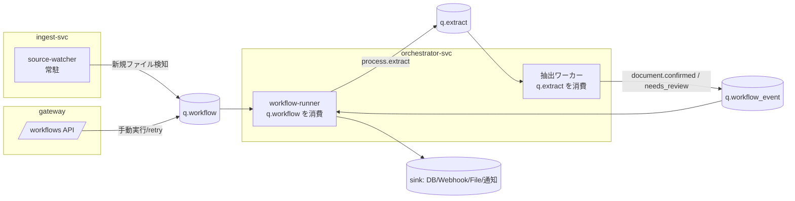
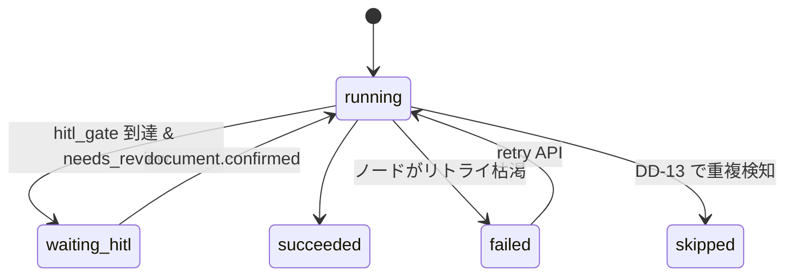

# §16 エージェントワークフロー（自動化層）詳細設計 v0.1

- 状態: Draft（実装未着手。着手前にレビューと未決事項の判断が要る）
- 日付: 2026-07-16
- 親: `NewFan_AI-OCRエージェント詳細設計書_v1.2.md` §16
- 関連: ADR-0003（ECS/Fargate）、DD-11（抽出グラフ不可侵）、DD-12（DB格納の制約）、DD-13（冪等取込）

本書は v1.2 §16 の「何を作るか」を、**そのまま実装に入れる粒度**まで降ろしたもの。
v1.2 §16 と矛盾する箇所は本書が新しいが、DD-11/12/13 は不変。

---

## 1. 目的とスコープ

### 1.1 これは何か

admin が「どのデータソースを、どのスキーマで抽出し、どう分岐・変換し、どこへ届けるか」を
ノードエディタ（SCR-07）で定義する自動化層。代表例：

> S3 の `invoices/` を監視 → 請求書 v4 で抽出 → 要確認は HITL へ／自動確定分は
> マッピングして基幹 DB へ UPSERT → Slack 通知

### 1.2 既存資産との境界（最重要）

**抽出グラフ（§4）には一切手を入れない（DD-11）。** ワークフローは抽出グラフを
サブグラフとして「呼ぶ」だけで、その内部構成・ノード・state を知らない。

| レイヤ | 実体 | 状態の持ち方 | 本書の扱い |
|---|---|---|---|
| 抽出グラフ（§4） | LangGraph、15 ノード | LangGraph checkpointer（`checkpoints` 表） | **不可侵**。`POST /documents/{id}/extract` 相当の内部呼出しで起動し、結果だけ見る |
| ワークフロー（§16） | 粗粒度 DAG | `workflow_runs.state`（JSONB） | 本書で新規実装 |

両者の interrupt/resume は**別レイヤ**である。抽出グラフの interrupt は
LangGraph の機能、ワークフローの HITL 待機は `workflow_runs.status='waiting_hitl'` で
DB に永続化する。ここを混ぜると、抽出グラフの checkpointer にワークフローの
状態が混入して DD-11 を破る。

### 1.3 スコープ外

- 抽出グラフの改変（DD-11）
- 任意 SQL の実行（DD-12。プリペアド生成のみ）
- ワークフローからのスキーマ/ルール変更（それらは §5.5 / §5.8.4 の管理画面の責務）

---

## 2. アーキテクチャ



### 2.1 新規コンポーネント

| 名前 | 置き場所 | 役割 |
|---|---|---|
| `newfan-workflow` | `packages/workflow` | graph_json のモデル・lint・ノードカタログ。**純ロジック**（DB も HTTP も持たない）。gateway と orchestrator の両方が import する |
| source-watcher | `services/ingest`（新規 `watcher.py` + `watcher_main.py`） | トリガー評価の常駐ワーカー |
| workflow-runner | `services/orchestrator`（新規 `workflow_runner.py`） | DAG エグゼキュータ |
| sink アダプタ | `services/export`（既存の webhook を含む） | DB/Webhook/ファイル/通知への出力 |

`newfan-workflow` を純ロジックに保つのは、lint と実行計画を **DB 無しで単体テスト**
できるようにするため。既存の `packages/normalizers` `packages/validators` と同じ方針。

### 2.2 なぜ ingest-svc に watcher を置くか

folder_watch は「外部ストレージを見て documents を登録する」ので、責務は取込
（§5.1）そのもの。orchestrator に置くと、抽出の実行待ちで watcher が詰まる。

### 2.3 プロセス構成（ECS）

| タスク | 台数 | 備考 |
|---|---|---|
| `ai-ocr-source-watcher` | 1（MVP） | 常駐。ポーリング間隔は既定 60s |
| `ai-ocr-orchestrator-worker` | 既存 | workflow-runner を同居させる（別コンシューマグループ） |

**コスト影響**: watcher が 1 タスク増える（0.25vCPU/0.5GB ≒ $0.012/h ≒ 月 $9）。
ADR-0003 の「使う時だけ up」運用では実質無視できるが、常駐が前提の機能なので
「ワークフローを使うなら止められない」という運用制約が生まれる。→ 未決事項 Q4。

---

## 3. データモデル

DDL は v1.2 §16.6 が正で、**既に `0001_initial_schema.py` に入っている**
（`connections` / `workflows` / `workflow_runs` / `source_cursors`）。
`jobs.kind` の CHECK にも `'workflow'` `'watch'` が含まれている。

### 3.1 追加が要るもの

```sql
-- workflow_runs は「どのノードまで進んだか」を state に持つが、
-- ノード単位の履歴（retry の起点、所要）が引けない。§16.7 の
-- POST /workflow-runs/{id}/retry が「失敗ノードから再実行」を要求するため、
-- どのノードが失敗したかを構造で持つ必要がある。
CREATE TABLE workflow_node_runs (
  id               TEXT PRIMARY KEY,
  tenant_id        TEXT NOT NULL,
  workflow_run_id  TEXT NOT NULL REFERENCES workflow_runs(id) ON DELETE CASCADE,
  node_id          TEXT NOT NULL,
  node_type        TEXT NOT NULL,
  status           TEXT NOT NULL DEFAULT 'pending'
    CHECK (status IN ('pending','running','succeeded','failed','skipped')),
  attempt          INT NOT NULL DEFAULT 0,
  input            JSONB,
  output           JSONB,
  error            JSONB,
  started_at       TIMESTAMPTZ,
  finished_at      TIMESTAMPTZ,
  UNIQUE (workflow_run_id, node_id)
);
CREATE INDEX idx_wf_node_runs ON workflow_node_runs (tenant_id, workflow_run_id);
```

RLS は §7.3 に準拠（`ENABLE` + **`FORCE`**、ポリシーは `tenant_id = current_setting('app.tenant_id', true)`）。
`0002_force_rls.py` の `_RLS_TABLES` にも足すこと。**足し忘れるとそのテーブルだけ
所有者バイパスが残る**（`db/tests/test_rls_isolation.py` が検知する）。

アプリロール（`newfan_app`）への GRANT は `ALTER DEFAULT PRIVILEGES` で自動的に付く
（`scripts/ensure_app_role.py` が設定済み）。

### 3.2 workflow_runs.state の形

```json
{
  "cursor": "n4",
  "node_outputs": {
    "n1": {"document_id": "doc_...", "source_key": "invoices/a.pdf"},
    "n3": {"run_id": "run_...", "status": "needs_review"}
  },
  "waiting": {"node_id": "n5", "since": "2026-07-16T00:00:00Z", "for": "document.confirmed"}
}
```

`node_outputs` を state に持つのは、ノード間のデータ受け渡しを DAG の辺に沿って
行うため。`workflow_node_runs.output` にも同じものが入るが、そちらは履歴・監査用で、
実行時の参照は state を見る（1 クエリで済ませるため）。

---

## 4. graph_json とノードカタログ

### 4.1 スキーマ

```json
{
  "version": 1,
  "nodes": [
    {"id": "n1", "type": "source.folder_watch", "config": {...}, "pos": [16, 100]}
  ],
  "edges": [
    {"from": "n1", "to": "n3", "label": "任意"}
  ]
}
```

- `id` はグラフ内で一意。`edges` の `from`/`to` は既存 `id` を指すこと。
- `pos` は UI 専用。実行エンジンは無視する。
- pydantic モデル（`packages/workflow/models.py`）で厳格に検証し、**未知の `type` は
  保存時に弾く**（実行時に初めて落ちると、有効化済みのワークフローが本番で死ぬ）。

### 4.2 ノードカタログ（MVP）

各 config は pydantic モデルで定義する。以下は契約。

#### トリガー

| type | config | 備考 |
|---|---|---|
| `source.folder_watch` | `connection_id`, `path`, `extensions: [".pdf",".png"]`, `interval_sec` (既定 60) | DD-13 冪等取込 |
| `source.email_attachment` | `connection_id`, `from_filter?`, `subject_filter?` | 添付のみ取込 |
| `source.manual` | （なし） | `POST /documents` / UI アップロード起点 |
| `source.schedule` | `cron` | 再処理・定期バッチ |

#### 処理

| type | config | 備考 |
|---|---|---|
| `process.classify` | `doc_types: ["invoice","order"]`, `on_unknown: "default_route"\|"halt"` | 1 ページ目レイアウト + LLM 分類 |
| `process.extract` | `schema_id`, `options: {force_vl?: bool}` | **抽出グラフ呼出し（DD-11）** |

`process.extract` の `schema_id` は**必須**。省略を許すと `load_context` が空スキーマを
返し、KIE が 1 項目も抽出しないまま「成功」する（実 AWS で踏んだ挙動）。

#### 分岐

| type | config | 備考 |
|---|---|---|
| `branch.condition` | `branches: [{when, to}]`, `else` | **else 必須** |
| `branch.hitl_gate` | `priority_boost?`, `assignee_group?`, `sla_hours?` | needs_review→確定を待って下流継続 |

#### 変換 / 出力

| type | config | 備考 |
|---|---|---|
| `transform.map_fields` | `mappings: [{from, to, format?, const?, mask?}]` | |
| `sink.db_write` | `connection_id`, `table`, `mode: "insert"\|"upsert"`, `keys[]`, `on_failure` | DD-12 |
| `sink.webhook` | `connection_id`, `payload_template?` | 署名は §6.4 |
| `sink.file` | `connection_id`, `path`, `format: "json"\|"csv"` | |
| `sink.notify` | `connection_id`, `template`, `when?` | Slack/Teams/メール |

### 4.3 条件式（`branch.condition.when`）

**任意の式を評価しない。** `eval` は論外だし、汎用式言語を入れると lint も
テストもできなくなる。以下の限定文法だけを解釈する（`packages/workflow/expr.py`）：

```
<expr>  := <operand> <op> <literal>
<operand> := "run.status" | "run.confidence" | "doc.doc_type"
           | "field['<name>'].value" | "field['<name>'].confidence"
<op>    := "==" | "!=" | ">" | ">=" | "<" | "<="
<literal> := 数値 | 'シングルクォート文字列'
```

複合条件（`and`/`or`）は MVP では持たない。必要なら分岐ノードを直列に置く。
→ 未決事項 Q2。

---

## 5. 構成 lint

保存時・有効化時に実行し、UI に指摘一覧を返す（`packages/workflow/lint.py`、純関数）。

| ID | 規則 | 重大度 |
|---|---|---|
| `L001` | DAG であること（閉路なし） | error |
| `L002` | トリガーノード ≥ 1 | error |
| `L003` | 到達不能ノードなし | error |
| `L004` | `sink.db_write` / `sink.file` の上流に必ず `process.extract` | error |
| `L005` | `branch.condition` は `else` 必須 | error |
| `L006` | `edges` の参照先が存在する | error |
| `L007` | `sink` 直前のマッピング未定義列 | warning |
| `L008` | `auto_confirm=false` で `branch.hitl_gate` を経ずに `sink` へ到達する経路 | warning |
| `L009` | `process.extract` の `schema_id` が実在する（tenant 内） | error |
| `L010` | `connection_id` が実在し `status in (active,tested)` | error |

L009/L010 は DB 参照が要るので、lint 関数は「参照解決関数」を注入で受ける
（純ロジックを保つため）。

---

## 6. 実行エンジン

### 6.1 状態機械（workflow_runs.status）



### 6.2 実行モデル

workflow-runner は `q.workflow` を消費する。1 メッセージ = 1 ステップ（1 ノード実行）
であり、**1 run を 1 プロセスで最後まで回さない**。理由：

- `process.extract` は数十秒〜数分かかる。抱えたまま待つとワーカーが枯れる
- HITL 待ちは数時間〜数日。プロセスで待つのは論外
- ECS タスクはいつでも落ちる。進捗が DB にあれば別タスクが拾える

つまり **DB を唯一の真実**にした継続渡し。`jobs.status` を更新しないと
クライアントが永久に待つ問題（本セッションで実際に踏んだ）と同じ構図なので、
各ステップは必ず `workflow_node_runs` と `workflow_runs.state` を更新してから ack する。

### 6.3 ステップの手順

```
1. workflow_runs を SELECT ... FOR UPDATE SKIP LOCKED で取る（多重実行防止）
2. state.cursor のノードを workflow_node_runs に running で記録
3. ノード実行
   - 同期ノード（branch/transform/sink）はその場で実行
   - 非同期ノード（process.extract）は q.extract に積んで waiting へ。ここで ack
4. 出力を state.node_outputs[node_id] に格納
5. 次ノードを決めて state.cursor を進め、q.workflow に自分自身を再投入
6. ack
```

### 6.4 抽出の完了をどう受けるか

抽出ワーカー（既存）は完了時に webhook を撃つ（`document.needs_review` /
`document.confirmed`）。ワークフローがそれを購読する経路が要る。

**採用案**: 既存 webhook 機構に相乗りせず、抽出ワーカーが `q.workflow_event` へ
内部イベントを積む。`workflow_runs.state.waiting` を引いて該当 run を再開する。

理由: 顧客向け webhook（§6.4）は外向きで、失敗・遅延・再送がある。内部制御を
そこに乗せると、顧客の webhook が落ちるとワークフローが止まる。

→ 抽出ワーカーに 1 行の追記が要る（`export_enqueue` と同じ注入形）。
**これは抽出グラフの改変ではない**（DD-11 は graph の構成を指す）。

### 6.5 リトライ

- ノード単位、既定 3 回、指数バックオフ（`workflow_node_runs.attempt`）
- sink 失敗時ポリシー: `retry` / `skip_and_notify` / `halt_notify`（既定 `halt_notify`）
- 枯渇したら `workflow_runs.status='failed'`、`error` に最終エラー
- DLQ は §9 準拠（`q.workflow.dead`）

### 6.6 同時実行

- ワークフロー単位の並列上限 既定 10 run（超過分はキューで待つ）
- 同一ファイルは DD-13 により skip（`source_cursors` の UNIQUE で担保）

---

## 7. トリガー（source-watcher）

### 7.1 冪等取込（DD-13）

```
1. connection の設定でストレージを列挙
2. 各ファイルの (source_key, content_hash) を計算
   - S3 は ETag を使う（ダウンロード不要。ただし multipart では MD5 でない点に注意）
   - ETag が使えない場合のみ本文を読んで sha256
3. source_cursors に INSERT（UNIQUE 制約）
   - 衝突 = 処理済み → skip（workflow_runs は作らない）
   - 成功 = 新規 → documents 登録 → workflow_runs 発行 → q.workflow
```

`content_hash` を含めて UNIQUE にしているので、**同じパスに中身違いが置かれたら
再処理される**。同じ中身の再アップロードは skip。これが DD-13 の意図。

### 7.2 検知遅延

`watch_lag_seconds{connection}` = 「ファイルの更新時刻 → workflow_runs 発行」。
§16.8 のアラートは 10 分。

### 7.3 MVP の割り切り

- S3 のみ実装。SFTP / Google Drive / SharePoint は接続アダプタの Protocol だけ切って
  未実装（`NotImplementedError`）。→ 未決事項 Q1
- `source.email_attachment` も同様に後回し

---

## 8. HITL ゲート

```
branch.hitl_gate に到達:
  上流の process.extract の結果が
    confirmed    → そのまま下流へ
    needs_review → workflow_runs.status='waiting_hitl'
                   state.waiting = {node_id, since, for: "document.confirmed"}
                   review キューに priority_boost を反映
                   ここで ack（プロセスは待たない）

document.confirmed イベント受信:
  waiting の run を引いて running に戻し、下流へ進む
```

### 8.1 auto_confirm の扱い（§16.1）

- 既定 OFF。
- `auto_confirm=true` でも **critical フィールドを含む帳票は必ず HITL ゲートを通す**。
- テナント設定で緩和可能だが、有効化時に警告 ＋ `audit_logs` に記録。

critical の判定は `field_schemas.fields[].critical`。ゴールデン計測で
`critical_exact_match` が 0.800 に留まっている（発行元がロゴ画像だと読めない）現状、
**critical の自動確定を許すのは時期尚早**。→ 未決事項 Q3。

---

## 9. sink の安全策（DD-12）

### 9.1 DB 格納

- **プリペアド生成のみ**。任意 SQL は受け付けない
- **INSERT / UPSERT 限定**（UPDATE / DELETE 不可）
- 書込み先は `connections.allowed_tables` に限定
- 1 run あたり書込み行数上限 既定 1,000
- 顧客側 DB ユーザーは INSERT/UPSERT 権限のみの専用ユーザーを推奨（導入手順書に明記）

テーブル名・列名は識別子なのでバインドできない。`psycopg.sql.Identifier` で
クォートし、かつ `allowed_tables` との完全一致を必須にする（正規表現の許可では
`erp.invoices_evil` のような近接名を通してしまう）。

### 9.2 Webhook

- 署名 `X-NF-Signature`、`X-NF-Timestamp`（§6.4）
- SSRF ガードは `newfan-netguard.is_blocked_url`（登録時と送信時の二段）

### 9.3 dry-run

- 直近の確定済み Run（または指定サンプル帳票）を入力に全ノードを実行
- sink は**実書込みせず**「生成される SQL / ペイロードのプレビュー」を返す
- **有効化は dry-run 成功が前提条件**

---

## 10. 接続管理と秘密情報

- `connections.config` に**秘密を入れない**。`secret_ref` に Secrets Manager の
  参照キーを持ち、実体は AWS 側に置く
- 現状の `POST /webhooks/endpoints` は `config.secret` に署名鍵を入れている。
  §16 の接続管理に寄せる際に `secret_ref` へ移す（→ 移行が要る。未決事項 Q5）
- LLM API キーと同様、**顧客の資格情報は利用者自身が Secrets Manager に登録**し、
  ARN だけをシステムに渡す運用にする

---

## 11. API（§16.7）

| メソッド | パス | 概要 | 権限 |
|---|---|---|---|
| GET / POST | `/workflows` | 一覧／新規作成 | admin |
| GET / PUT | `/workflows/{id}` | 取得／更新（**新版作成**） | admin |
| POST | `/workflows/{id}/activate` `/pause` | 有効化（lint＋dry-run 成功が前提）／一時停止 | admin |
| POST | `/workflows/{id}/dry-run` | ドライラン（sink プレビュー返却） | admin |
| GET | `/workflows/{id}/runs` | 実行履歴 | viewer+ |
| POST | `/workflow-runs/{id}/retry` | 失敗ノードからの再実行 | admin |
| GET / POST | `/connections` | 接続管理 | admin |
| POST | `/connections/{id}/test` | 疎通テスト | admin |

### 11.1 版の固定（§16.1）

有効化＝版の固定。`workflows.graph_json` は `field_schemas` と同様に版管理し、
実行中の `workflow_run` は**開始時点の版**（`workflow_runs.workflow_version`）を
参照し続ける。走行中に定義が変わって挙動が変わる事故を防ぐ。

---

## 12. 可観測性（§16.8）

`packages/metrics` に追加する（§12.1 と同じ場所。名前が割れないよう 1 箇所で定義）：

| メトリクス | 型 | ラベル |
|---|---|---|
| `workflow_runs_total` | counter | `workflow`, `status` |
| `workflow_node_duration_seconds` | histogram | `type` |
| `sink_write_rows_total` | counter | `connection` |
| `watch_lag_seconds` | gauge | `connection` |

アラート: 同一ワークフローの failed 連続 5 件 / `watch_lag > 10 分` / sink 書込み失敗率 > 5%/1h。

`workflow_runs` を Langfuse trace に紐付け、抽出 Run の trace へリンクする。

---

## 13. セキュリティ

- 全テーブルに RLS（`ENABLE` + `FORCE`）。`0002_force_rls.py` の `_RLS_TABLES` に追加
- workflow-runner / source-watcher も**アプリロール**（`newfan_app`）で繋ぐ。
  所有者で繋ぐと RLS が効かない（本セッションで実測した罠）
- config 変更・有効化/停止・dry-run は `audit_logs` へ（actor=human/agent）
- sink の宛先は SSRF ガードと `allowed_tables` で制限

---

## 14. 段階実装計画

**一度に全部作らない。** 各フェーズは単体で価値があり、実系で検証してから次へ進む。

| Phase | 内容 | 完了条件 |
|---|---|---|
| **P1** | `packages/workflow`（モデル + lint + 条件式）。DB も HTTP も無し | 単体テストが緑。lint の全規則に対する異常系テスト |
| **P2** | `/workflows` CRUD + activate/pause。SCR-07 なしで JSON 直投入 | 実 AWS で workflow を保存・有効化できる |
| **P3** | workflow-runner の骨格（manual トリガー → extract → condition → webhook） | 実 AWS で 1 本の DAG が端から端まで動く |
| **P4** | source-watcher（S3 のみ）+ DD-13 | S3 に置いたファイルが自動で抽出される。同じファイルを 2 回置いて skip される |
| **P5** | HITL ゲート | needs_review → 人が確定 → 下流継続を実系で確認 |
| **P6** | sink.db_write（DD-12）+ dry-run | dry-run のプレビューが実 SQL と一致。allowed_tables 外を拒否 |
| **P7** | SCR-07 ノードエディタ | |
| **P8** | 残りのトリガー/sink（SFTP/GDrive/メール/Slack） | |

P3 の時点で「動くワークフロー」が 1 本できる。そこまでを最小の縦切りにする。

---

## 15. テスト戦略

§14.1 に準拠しつつ、本機能固有の要点：

- **lint は純関数**なので全規則を単体で（異常系込み）
- **workflow-runner は実 PostgreSQL で結合テスト**（`db/tests/` と同じ形式）。
  InMemory だけだと ORM と DDL の乖離を検出できない（correction_logs で実際に踏んだ）
- **DD-13 の冪等性**は実 DB の UNIQUE 制約に当てる。アプリ側の重複判定では
  同時実行で抜ける
- **sink.db_write は実 PostgreSQL に対して**（プリペアドの識別子クォート、
  allowed_tables の完全一致、行数上限）
- ワークフローの結合テストで**抽出グラフを Fake にしてよい**（DD-11 の境界。
  抽出の精度はゴールデンセット §14.2 の担当）

---

## 16. 未決事項（着手前に判断が要る）

| # | 論点 | 選択肢 | 影響 |
|---|---|---|---|
| **Q1** | MVP のトリガーはどこまで | (a) S3 のみ (b) S3+メール (c) 全部 | (c) は接続アダプタ 4 種で工数が倍増する。実際に使うのはどれか |
| **Q2** | 条件式に and/or が要るか | (a) 単項のみ（分岐を直列） (b) and/or を入れる | (b) は式パーサと lint の複雑さが上がる |
| **Q3** | critical の自動確定を許すか | (a) 常に HITL（設計書の既定） (b) テナント設定で緩和可 | 現状 `critical_exact_match=0.800`。緩和は誤ったデータが基幹 DB に入る |
| **Q4** | source-watcher の常駐 | (a) 常駐（月 +$9、down 運用と両立しない） (b) EventBridge 定期起動 (c) S3 イベント通知 | (c) が最も安いが S3 限定。「使う時だけ up」の運用と watcher の常駐は本質的に相性が悪い |
| **Q5** | 既存 `POST /webhooks/endpoints` と §16 の接続管理 | (a) connections へ統合（移行が要る） (b) 併存 | 併存させると配信先が 2 箇所に散る |
| **Q6** | ノードエディタ（SCR-07）の実装方式 | (a) React Flow 等の既製 (b) 自作 | 画面設計書 SCR-07 の詳細が未確認 |

---

## 17. 見積り（粗い。Q1〜Q6 の判断で動く）

| Phase | 規模感 |
|---|---|
| P1 | 小（純ロジック。1〜2 日） |
| P2 | 小〜中（既存 CRUD の踏襲） |
| P3 | **大**（実行エンジンの骨格。ここが本体） |
| P4 | 中（S3 のみなら） |
| P5 | 中（イベント購読の配線） |
| P6 | 中〜大（DD-12 の安全策が厚い） |
| P7 | 大（ノードエディタ UI） |
| P8 | Q1 次第 |

P1〜P3 で「動く 1 本」まで到達するのが最初の目標。
