# NewFan AI-OCR エージェント サービス説明資料（実機画面版）

- **位置づけ**: 才流「SaaS 利用者説明会 実施ガイド」の方法論（対象を絞る／業務効果を前面に／30分／職種別ユースケース／その場で体験）に沿った説明会資料の**正本**。
- **対象**: **現場担当者（経理・受発注・物流事務など、帳票を読んで転記している人）向けの単部構成・30分**。管理者（情シス・業務改善・内部統制）向けの情報は**補足章**に収載。
- **編集方針（v3.0・2026-08-21）**: 本文は**実装済み・実機で動作確認済みの範囲**を基本とし、設計のみの事項は明示的に区別する。設計と現行ビルドの差分は**付録A**に集約 — デモ実施前に必読。数値は「実測」「設計目標（SLO）」「未実測」を必ず区別する。
- **画面はすべて実機**（ローカル実環境・2026-08-21 撮影）。gateway＋抽出ワーカー＋PP-StructureV3／PP-OCRv6 実推論サービス＋実 LLM（Gemini）のフルスタックを起動し、**実際に帳票をアップロード→実 OCR→実 LLM 抽出を実行して撮影**した。表示帳票はすべて公開サンプル・ダミーデータ（実顧客情報なし）。撮影条件の詳細は**付録B**。
- **スライド化の原則**: 1枚1メッセージ。§4 学習ループ＝3枚、§5 ワークフロー＝3枚、他は各節1〜2枚。各枚の「画面のポイント」は3点以内。**「発表者ノート」はスライド本体に載せない**。
- **本資料の主役（この2つを前面に出す）**: ① **一度直せば二度と直さない — 修正の恒久学習と検証ゲート**（§4）、② **読んだ後の転記まで、絵で組める壊れない自動化 — ワークフロー**（§5）。

---

# 現場担当者向け説明会（30分）

時間配分: §1 3分／§2 5分（デモ込み）／§3 5分（デモ込み）／**§4 7分（最重要・デモ込み）**／**§5 5分**／§6 2分／§7 1分／§8 体験ワーク1分／§9 まとめ1分。押した場合に飛ばす節は §6・§7。

## 1. いまの困りごと → AI-OCR エージェントとは（3分）

**問題**: 紙・PDF の帳票（請求書・発注書・見積書・納品書）を、人が目で読んで基幹システムに打ち直している。従来の AI-OCR を入れても解決しきらない理由は3つ。

1. **テンプレート地獄** — 取引先ごとに読み取り枠（座標）を登録する方式のため、取引先が増えるたび・先方がフォーマットを変えるたびに登録作業が発生する。
2. **結局、全件を目視突合している** — OCR が「読めた」と言っても信用できないので、1枚ずつ元帳票と見比べる。OCR を入れた後も工数が減らない。
3. **同じ間違いを毎月直している** — 「1 を 7 と読む」「あの取引先の社名表記だけ崩れる」。直した知識はどこにも残らず、翌月また同じ場所を直す。

**解決**: NewFan AI-OCR エージェントは、**テンプレート（座標）を登録しない AI-OCR**。登録するのは「何を取りたいか」という**項目名の一覧だけ**。AI が帳票を読み、**どこから取ったか（根拠）を必ず示し**、人が直した内容を**覚えて次回から自動で当てにいく**。さらに読み取った後の「基幹システムへの転記」まで、**ノードをつないだ絵**で自動化できる。

- **トーク**: 「今日お伝えしたいのは2つだけです。**登録するのは項目名だけ**。そして**一度直せば、次から直さなくていい**。この2つです」
- **提供形態（1行だけ）**: SaaS で提供。**個社別の専用環境・カスタマイズ実装 OCR も可能**（補足章 C-6）。

## 2. できること①: テンプレート登録なしで読む（5分・デモ込み）

**問題**: 「新しい取引先の請求書が来た。OCR に覚えさせるのに半日かかる」「先方がフォーマットを変えたら読めなくなった」。

**解決**: スキーマ（項目定義）が無くても、まず取り込めば **AI が帳票から項目を自動発見して抽出**する。結果を見ながら「残す項目」を選んで**テンプレート化**すれば、帳票種別ごとのスキーマが 1 回で出来上がる（座標も罫線位置もサンプル枚数も不要）。同じ「請求書」なら、レイアウトが違う取引先でも同じスキーマで読める。

### 操作手順（そのままデモ手順・全画面実機）

**手順1** — 帳票一覧。処理状態（アップロード済／要確認／確認中）が一目で分かり、右上からアップロード。共有フォルダ経由で自動取込された帳票（`gdrive://` `m365://` の取込元表示）も同じ一覧に並ぶ:

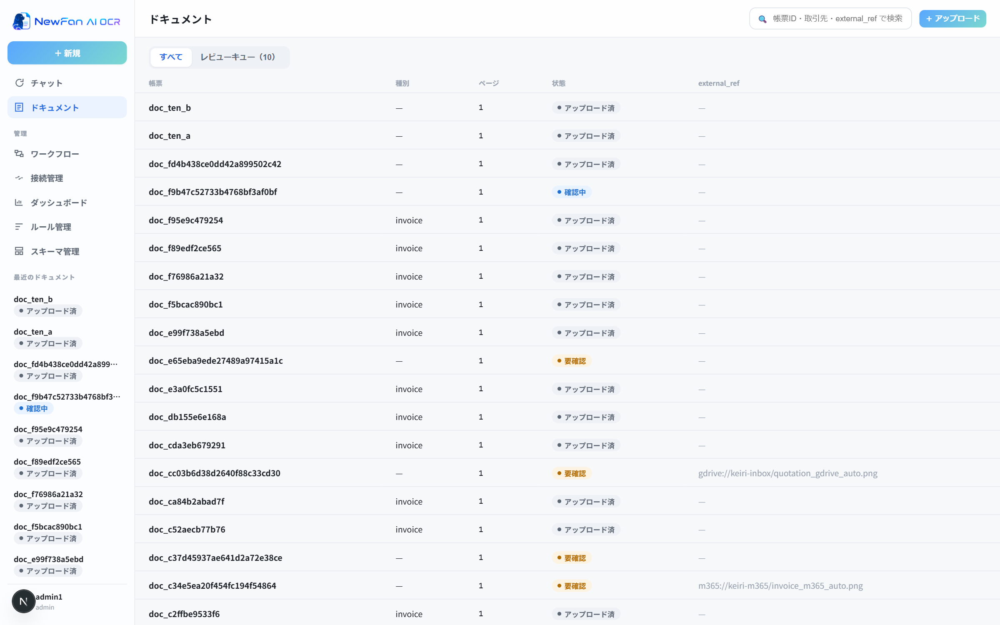

- **画面のポイント**: ① 取込元がファイルアップロード／Google Drive／Microsoft 365 混在で1つの一覧 ② 状態チップで「人が見るべきもの」だけが要確認 ③ レビューキュータブに要確認だけが集まる（優先度順）。

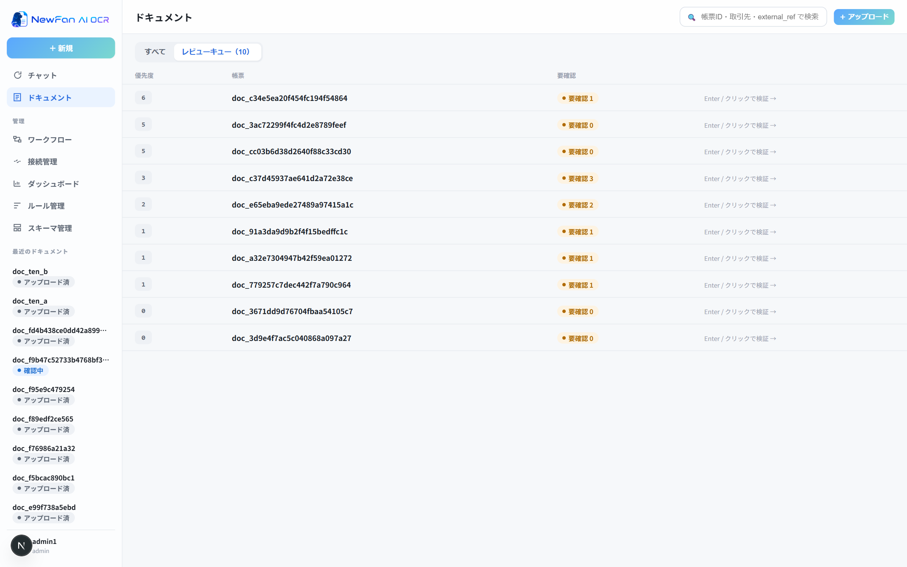

**手順2** — 「抽出を開始」。**システムがファイルの信号から帳票種別を推定**し、使うスキーマを既定選択する。推定が付かない・スキーマ未登録の帳票は**「スキーマなし — 項目を自動発見」が既定**になり、そのまま抽出できる（行き止まりにならない）。画面は実機で見積書ファイルを投入した実挙動 — 「🔎 推定: quotation・信頼度 100%（『quotation・estimate』がファイル名/本文に一致）— 違う場合は下で選び直せます」:

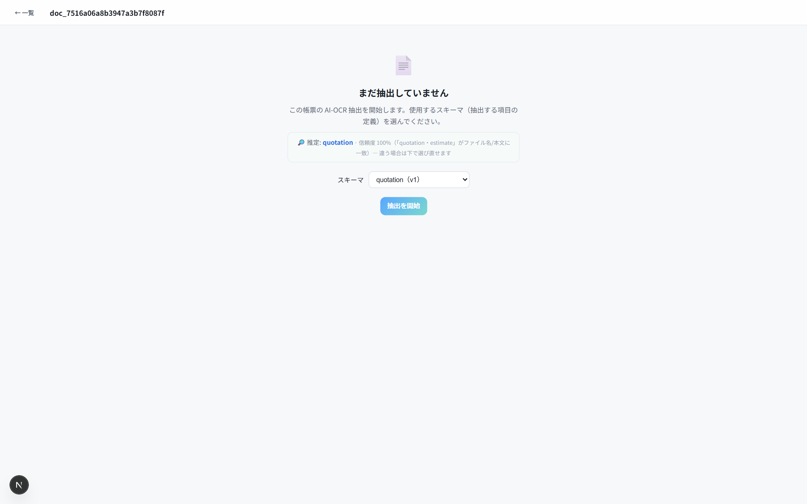

- **画面のポイント**: ① 推定種別と信頼度、**推定の理由**（どの語が一致したか）まで表示 ② 人が選び直せる（人の指定が常に最優先） ③ ここで押す1ボタンで実抽出が始まる。

**手順3** — 数十秒〜1分程度で結果が出る（本画面は**実際にこの場で実行した実抽出の結果**。所要時間の考え方は付録A）。取れた値ごとに確信度と検算結果が付き、明細表も行×列の構造ごと抽出される:

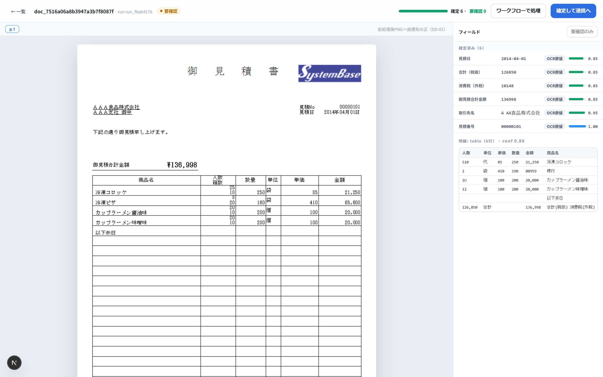

- **画面のポイント**: ① 6項目すべて確定済み・**要確認 0** — 金額の検算（126,850＋10,148＝136,998）に合格したため人の確認が不要になった ② 明細 6行が表として構造化（信頼度 0.88） ③ あとは「確定して連携へ」を押すだけ。
- **発表者ノート**: 所要時間は「OCR・レイアウト解析が A4 1ページ 12〜16 秒（実測）＋項目抽出の LLM 時間」。**エンドツーエンドの数値は約束しない**（未実測・帳票による）。デモでは実際に待って見せるのが最も誠実。
- **発表者ノート**: 「テンプレートレス」の説明は「**最初の 1 枚はスキーマ無しでも読める**（AI が項目を自動発見）。ただし**安定運用にはスキーマ化が前提**」と言う。自動発見の結果からワンクリックでテンプレート化できるのがこの製品の導入の速さで、スキーマ確定後は「項目が取れない」相談の大半は定義漏れが原因（実証済み: 4項目定義→4件抽出、15項目に拡張→15件すべて根拠付きで抽出成功）。

**項目を増やすのも1分** — スキーマ管理画面で足すか、**チャットで話しかけるだけ**。実機では「スキーマに『支払方法』を追加して」と送ると、AI が変更内容を**承認カード**で提案してくる。**人が「承認して実行」を押すまで、何も変わらない**:

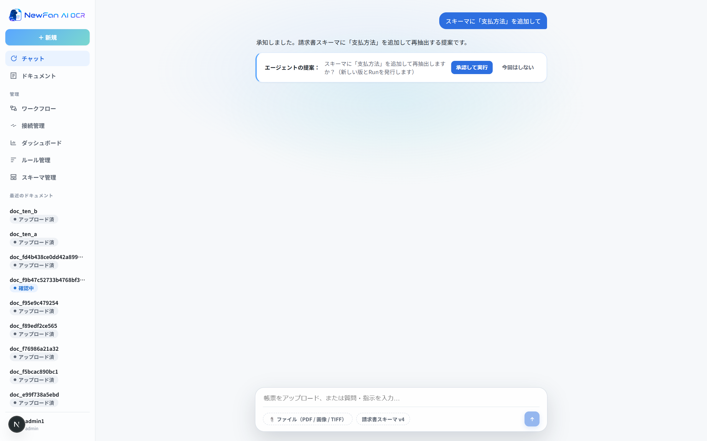

- **画面のポイント**: ① エージェントの提案が明文化される（「スキーマに『支払方法』を追加して再抽出しますか？（新しい版と Run を発行します）」） ② 選択肢は「承認して実行」と「今回はしない」 ③ 承認すると**新しい版**として保存される（版管理・前の版に戻せる）。

## 3. できること②: 全件突合をやめる — 見るのは機械が指した所だけ（5分・デモ込み）

**問題**: 「OCR の結果を全件、元の紙と見比べている。これなら手入力と変わらない」。

**解決**: 検証画面は「**どこを見ればいいか**」を機械が指定する。全件を見るのではなく、**機械が自信のない箇所だけ**を見る運用に変わる。

実機画面（実請求書サンプルを実 OCR・実 LLM で抽出した結果。確定14・要確認3）:

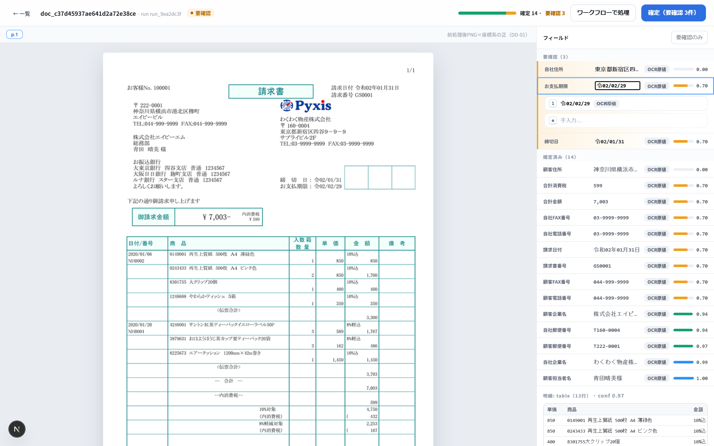

- **要確認が最上部に集まる** — 「要確認（3）」が上、確定済み（14）は下。**見るのは3件だけ**。
- **確信度バーの色分け** — 橙（低確信）／緑（高確信）／青（検算合格・1.00）。「要確認のみ」ボタンで絞り込みも可能。
- **候補採択がワンクリック** — 要確認の行を開くと `[1] OCR原値 / [e] 手入力` の候補が並び、キー1つで採択できる。
- **値の由来バッジ** — すべての値に「OCR原値／LLM補正／ルール／人手／VL」の由来が付く（画面右下に凡例）。
- **明細表も構造ごと** — 右下に明細13行が表として表示され、行構造・列名まで抽出される。

**「1 か 7 か」問題はこう見える** — 低確信の金額をクリックすると、帳票画像側の該当箇所が**枠でハイライト**され、候補が並ぶ。この画面では OCR が「¥I36,998」（先頭が I）と誤読した箇所に、AI が「136,998」を提案している:

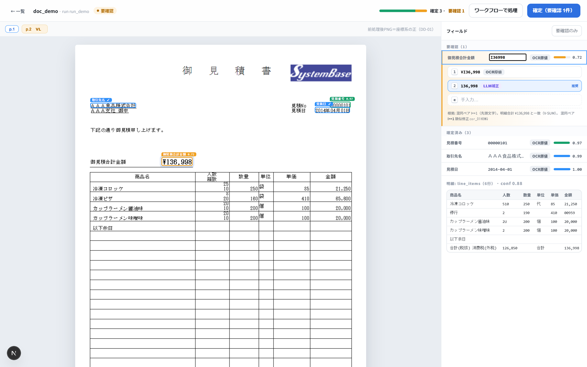

- **画面のポイント**: ① 帳票画像に色分きの枠 — 選択中の「御見積合計金額 0.72」は橙、確定済みの「取引先名 ✓」「見積番号 0.97」は緑/青 ② 候補は `[1] ¥I36,998 OCR原値 / [2] 136,998 LLM補正（推奨） / [e] 手入力` ③ **根拠が明文で付く** — 「混同ペア I↔1（先頭文字）。明細合計 ¥136,998 と一致（V-SUM）。混同ペア I↔1 類似修正 cor_01H8MQ」。
- **トーク**: 「AI が『なんとなくこう思う』ではありません。**視覚的に混同しうる文字の表に該当し、明細の合計とも一致し、過去に同じ修正をした記録がある** — ここまで揃った提案だけが出てきます。採択はキー `2` を押すだけです」
- **キーボードだけで完結** — 画面下部に常時表示: `n/p` 次/前の要確認、`Enter` 承認、`e` 編集、`⌘/Ctrl+Enter` 確定。編集は 500ms デバウンスで自動保存。

**機械が検算する項目**（決定論・AI 推論を使わず毎回同じ結果）: 明細合計＝小計、小計＋消費税＝合計、税率別（10%／軽減8%）の税額、数量×単価＝金額、適格請求書登録番号（`T`＋13桁）の**検査数字の整合**、銀行コード・口座の桁数、請求日≤支払期日。**検算に合格した項目は確信度が引き上げられ、人が見る対象から自動的に外れる**（§2 の実抽出で要確認が 0 件になったのはこの仕組み）。

- **発表者ノート**: 登録番号は「検査数字の整合を検証」まで。**「実在しない事業者を弾く」とは言わない**（国税庁 DB 照合はしない）。重複請求検知（V-DUP）は**現行未接続**（付録A）。「精度○%」「工数○%削減」は自社実測が取れるまで言わない。

## 4. できること③: **一度直せば、二度と直さない**（7分・デモ込み）★本日の主役

**問題**: 現場の最大の不満。

> 「あの取引先の請求書、毎月かならず**同じ場所**を同じように直している。私が直したことは、どこにも残らない」

**解決**: 人が直した内容を**組織の資産として蓄積**し、AI が次回から自動で当てにいく。しかも「なんとなく似ているから当てる」のではなく、**再現できることを機械が検証してから**恒久ルールに昇格させる。

### 学習の3段階（スライド1枚目）

**第1段: 修正メモリ（1件から、その場で効く）**
検証画面で直した1件は、`帳票種別 × 取引先 × 項目 × 原値 × 周辺文脈` のキーとともに保存される。次に似た文脈の帳票が来たとき、AI は過去の修正例（類似上位5件・類似度0.75以上）を参照しながら読む。§3 の画面で根拠に出ていた「類似修正 cor_01H8MQ」がまさにこれ — **過去の修正が、今日の帳票の補正候補の根拠として引用されている**。

**第2段: ルール化（同じ直しが5件たまったら自動起動）**
同種の修正が5件たまると、システムが「ルールにできないか」を自動で検討する。取り出されるのは4種の**決定論ルール**と1種の **LLM 最適化**:

| ルール種別 | 内容 | 例 |
|---|---|---|
| `regex_replace` | パターン置換 | 伝票番号の先頭に混入する記号を除去 |
| `vocab_map` | 語彙の写像（表記ゆれの名寄せ） | 「サンフル商事」→「サンプル商事」 |
| `format` | 書式の強制 | 伝票番号は先頭「7」の6桁 |
| `checksum` | 検査数字の検証 | 適格請求書登録番号 |
| `llm_hint` | 決定論化できない業務知識を日本語のまま AI に渡す | 「合計金額は『御請求金額』の値を優先し、内訳行の小計と混同しないこと」 |

**第3段: 自動検証ゲート（間違ったルールを本番に出さない）★差別化点**
抽出されたルールはいきなり有効にならない。**そのテナントの過去の確定済み帳票に機械が再適用**し、**過去修正の再現率 90% 以上・すでに正しかった値への誤適用 0 件**の両方を満たしたときだけ有効化される。

実機のルール管理画面 — llm_hint 2件（有効1・承認待ち1）が登録され、ルールの中身（JSON）と有効化条件が画面に明記されている:

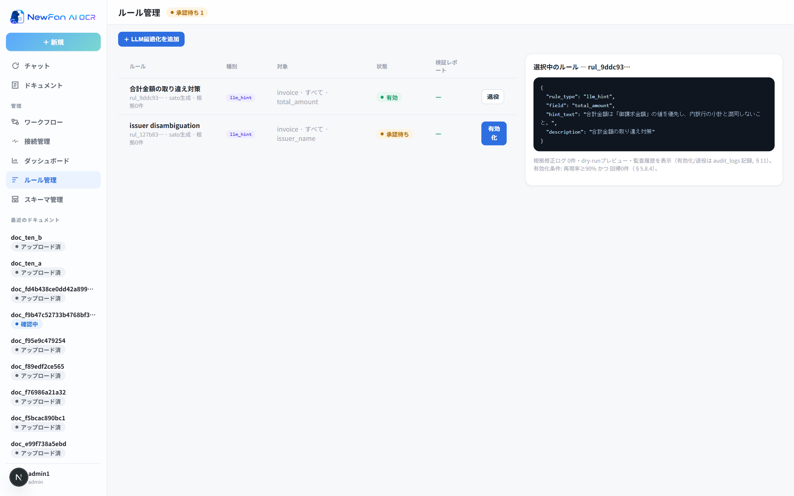

- **画面のポイント**: ① ルールごとに種別・対象（invoice・total_amount）・状態（有効／承認待ち）・検証レポート列 ② 選択中ルールの定義がそのまま読める — 「合計金額は『御請求金額』の値を優先し、内訳行の小計と混同しないこと」という**日本語の業務知識**が AI への指示として登録されている ③ 画面下部に「**有効化条件: 再現率≥90% かつ 回帰0件**」「有効化/退役は監査記録」と明記。
- **トーク**: 「学習する AI-OCR は他社にもあります。違いは、**学習した内容が本当に正しいかを過去データで機械が検算してから本番に出す**こと。間違った学習が本番を壊す事故を、仕組みで防いでいます」

### 「コツを教える」もできる — LLM 最適化（スライド2枚目）

正規表現では書けない業務知識を、**管理画面のフォームから日本語の文章のまま**登録できる。実機で入力中の画面:

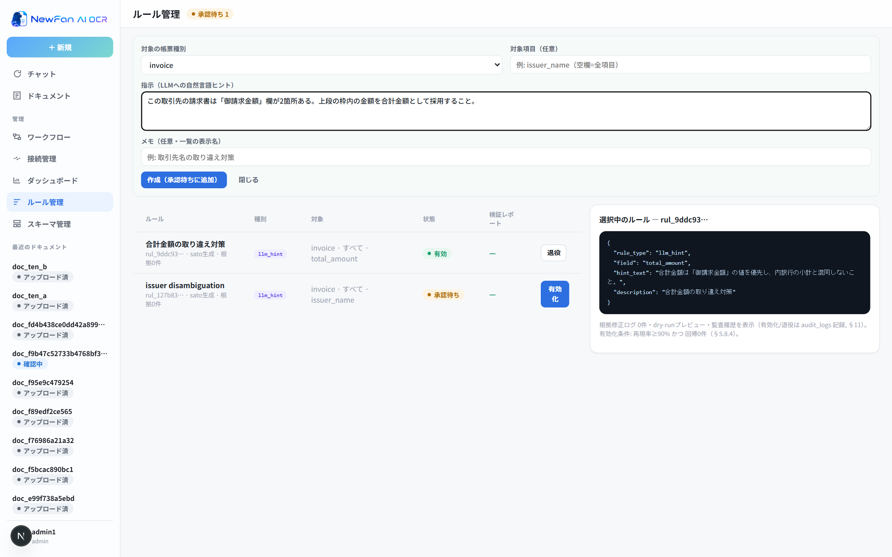

- **画面のポイント**: ① 対象の帳票種別・対象項目（空欄=全項目）を選ぶだけ ② 指示は自然言語 — 「この取引先の請求書は『御請求金額』欄が2箇所ある。上段の枠内の金額を合計金額として採用すること。」 ③ 作成すると**承認待ち**に入る（勝手に本番へ入らない）。
- **人が書いたヒント**は再現率検証の対象外でそのまま有効化できる。**AI が自動生成したヒントは検証ゲートを必ず通す** — 「検証されていない学習が1クリックで本番へ入る」経路を作らない意図的な非対称。

### AI が勝手に書き換えないための2重の縛り（スライド3枚目）

- **縛り①（混同文字表）** — AI の自動置換が許されるのは、**視覚的に混同しうる文字の組み合わせ**（1↔7↔I、0↔O↔〇、8↔B、カ↔力、ロ↔口、未↔末 など事前定義の表）に該当する場合、**または**過去の修正例に一致する場合**だけ**。§3 の画面の根拠表示「混同ペア I↔1」はこの縛りが実際に働いている証拠。それ以外の変更は自動適用されず必ず人の確認へ。
- **縛り②（根拠必須）** — すべての抽出値は帳票画像上の**実在する読み取り領域に紐付く**ことが必須。紐付かない値は確信度 0 で強制的に人の確認へ。**AI が根拠なしに値を作ることはできない。**

### 学習の効きは数字で見える

実機ダッシュボード — STP率（修正なしで確定した割合）26.7%、フィールド精度（確定フィールドの無修正率）100%、LLM コスト実測 ¥2.77、そして「学習の効き」ブロックに累計人手修正4→修正メモリ2→有効ルール1→承認待ち1 の変換ファネル:

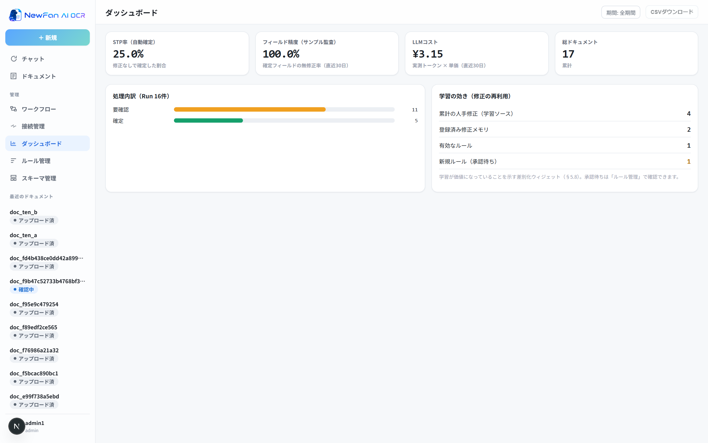

- **発表者ノート**: 「フィールド精度」は**無修正率**（外部基準の正解率ではない）。LLM コストは Run ごとの実トークン×単価の実測合計。「◯ヶ月で確認ゼロ」等の時間軸は約束しない。

## 5. できること④: 読んだ後の転記も、絵で組める — 壊れない自動化（5分）★主役その2

**問題**: OCR は「読む」まで。読んだ後の転記は、人が打つか、画面操作型 RPA で自動化するか。**RPA は画面レイアウトが変わると壊れ、壊れたことに気づかない**。

**解決**: 「どこから取り込み → どう読み → どう分岐し → どう変換して → どこへ届けるか」を、**ノードをつないだ図**として定義する。画面座標にも UI にも依存しないため、画面改修やフォーマット変更の影響を受けない。

実機のワークフローエディタ — 稼働中（active v3）の「ローカル基幹DB格納」。手動実行→AI-OCR 抽出→HITL ゲート→フィールド変換→DB 格納 の5ノード。右パネルは「DB 格納」ノードの設定フォーム:

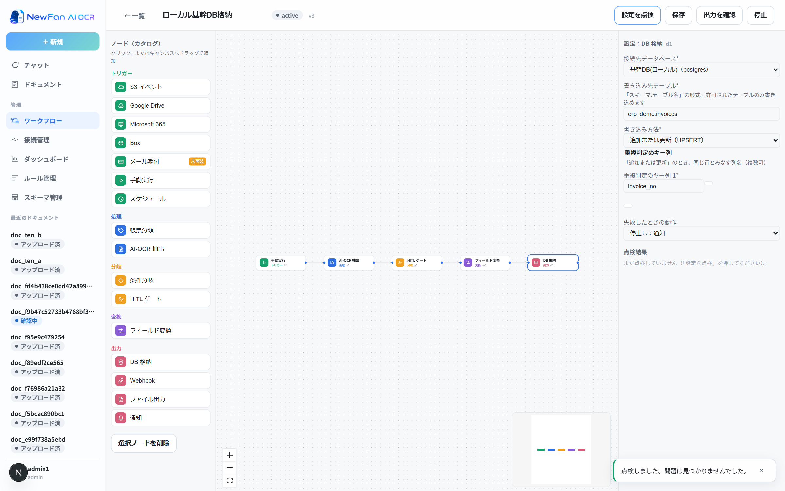

- **画面のポイント**: ① 左パレットから16種のノードをクリック/ドラッグで追加（トリガー: S3・Google Drive・Microsoft 365・Box・手動・スケジュール／処理: 帳票分類・AI-OCR 抽出／分岐: 条件分岐・HITL ゲート／変換／出力: DB・Webhook・ファイル・通知。**メール添付は「未実装」バッジ付きで正直に表示**） ② 設定は**すべて日本語フォーム** — 接続先 DB・書き込み先テーブル・「追加または更新（UPSERT）」・重複判定のキー列・失敗したときの動作（停止して通知） ③ 右下トースト「点検しました。問題は見つかりませんでした。」— 保存前に必ず機械点検が走る。

**現場の方に覚えてほしい型は1つ**:

> フォルダに置く → 自動で読まれる → **自信のないものだけ、あなたのレビューキューに届く** → あなたが確定した瞬間、基幹システムに入る

検証画面から直接ワークフローに乗せることもできる（「ワークフローで処理」→ 稼働中ワークフローを選んで実行）:

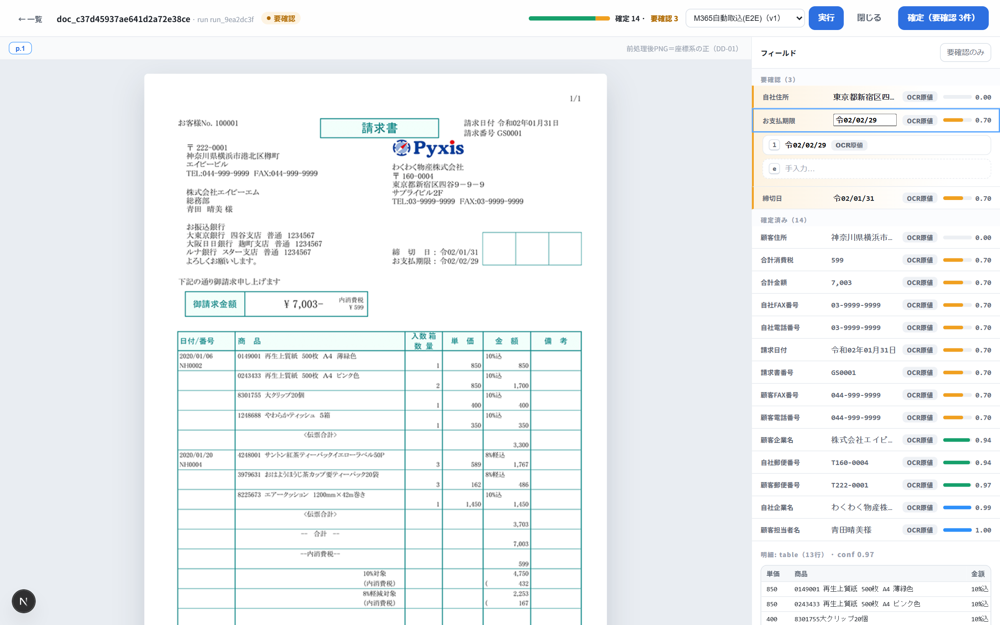

### 「壊れない」ための3つの仕掛け

**① 自動点検（lint）** — 業務として成立しない図を機械が検出し、該当ノードを赤くハイライトする。実機で意図的に壊れた図（抽出ノード無しで DB 格納・未テストの接続）を点検した画面:

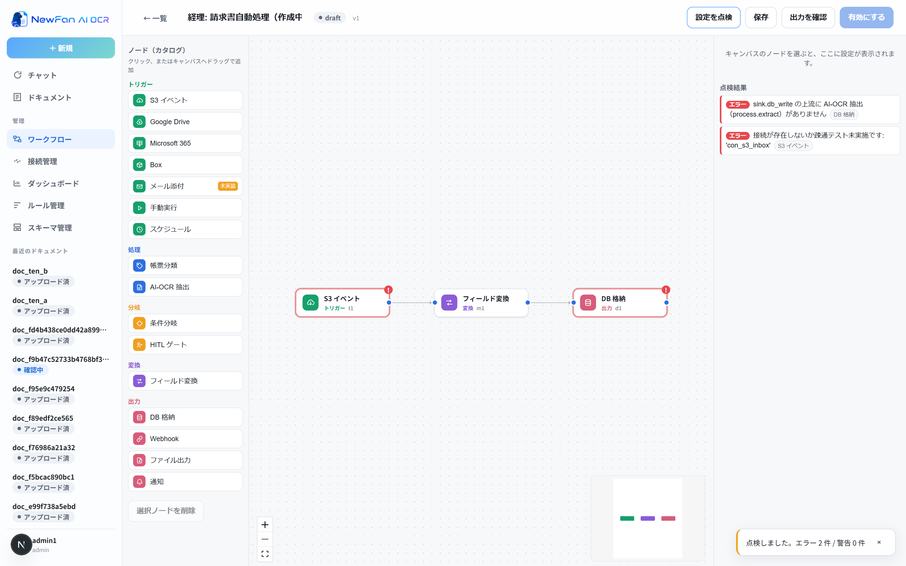

- **画面のポイント**: ① 「エラー: sink.db_write の上流に AI-OCR 抽出（process.extract）がありません」— **読んでいないデータを基幹に流す構成は組めない** ② 「エラー: 接続が存在しないか疎通テスト未実施です」— 未確認の接続先には流せない ③ 問題ノードが赤枠でハイライト、右下に「エラー2件/警告0件」。**エラーがある図は有効化できない。**

**② 出力プレビュー（dry-run）** — 有効化の前に「本番で何が起きるか」を実データで確認できる。実機の出力プレビュー — DB 格納ノードが `erp_demo.invoices` へ書き込む**列と値の対応表**、さらに「SQL を表示（上級者向け）」まで:

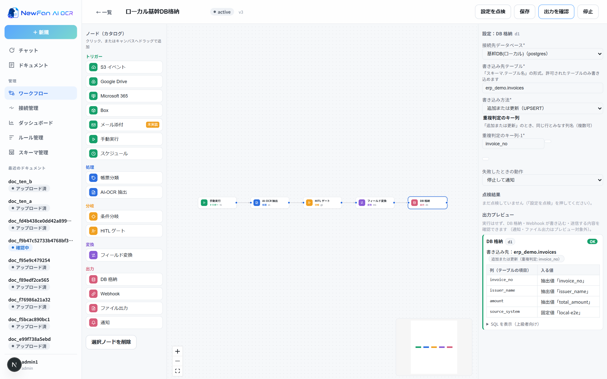

- **画面のポイント**: ① 「実行はせず、DB 格納・Webhook が書き込む・送信する内容を確認できます」 ② invoice_no ← 抽出値「invoice_no」、amount ← 抽出値「total_amount」、source_system ← 固定値 — **転記のマッピングが目で確認できる** ③ プレビューと本番実行は**同一のコード**が SQL を生成（「プレビューでは通ったのに本番で違う」が起きない）。

**③ 能力の構造的制限** — DB への書き込みは **INSERT/UPSERT のみ（UPDATE・DELETE は機能として存在しない）**、書き込み先は許可テーブル完全一致のみ、任意 SQL 不可、1実行1,000行上限。**AI が基幹のデータを消したり書き換えたりすることは、構造的にできない。**

### 取込元（接続）も1画面で健全性が見える

実機の接続管理 — Google Drive・Box・Microsoft 365・基幹 DB（PostgreSQL）が並び、**最終同期の成否**（✓1分以内／✗失敗（3日前）＋理由）まで表示。失敗した接続はエラー内容付きで赤表示され、「今すぐ同期」で手動リトライできる:

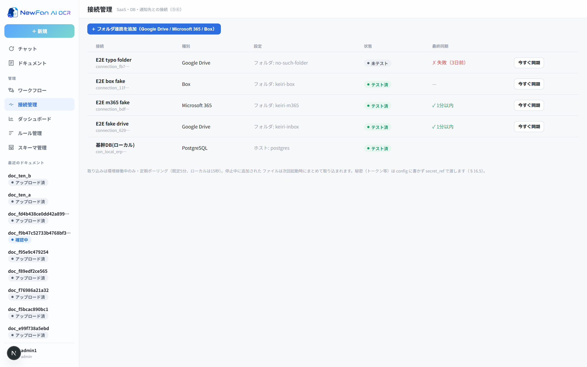

- **実測（そのまま話せる数字）**: S3 配置→**約2秒**で自動取込。Google Drive／Microsoft 365 のフォルダは**配置から15秒以内**に検知（ローカル実測。SaaS 環境の既定ポーリングは5分間隔）。確定操作から**1秒未満**で基幹 DB へ実 UPSERT。同一ファイルはコンテンツハッシュで自動スキップ（二重取込しない）。
- **発表者ノート**: ワークフローの構築・有効化は管理者権限。現場向けには「要確認だけが自分のキューに届く」体験を主語に。メール添付トリガーは未実装（画面に「未実装」表示・有効化不可）。

## 6. 誤魔化さない AI — 分からないときは「分かりません」と言う（2分）

**問題**: 生成 AI の幻覚。「AI が入れた数字が帳票のどこにも無かった」は経理では事故になる。

**解決**: 「自信がないなら人に回す」が既定動作。

- **根拠が取れない値は確定させない**（§4 縛り②）。
- **確信度が閾値未満は必ず人の確認へ**（重要項目 0.90／標準 0.80／備考など 0.60。無条件レビュー指定も可能）。
- **読みにくいページは正直に申告する** — 品質の低いページを画像 AI（VL）で補った場合、実機ではページに**警告バナー**が出る:

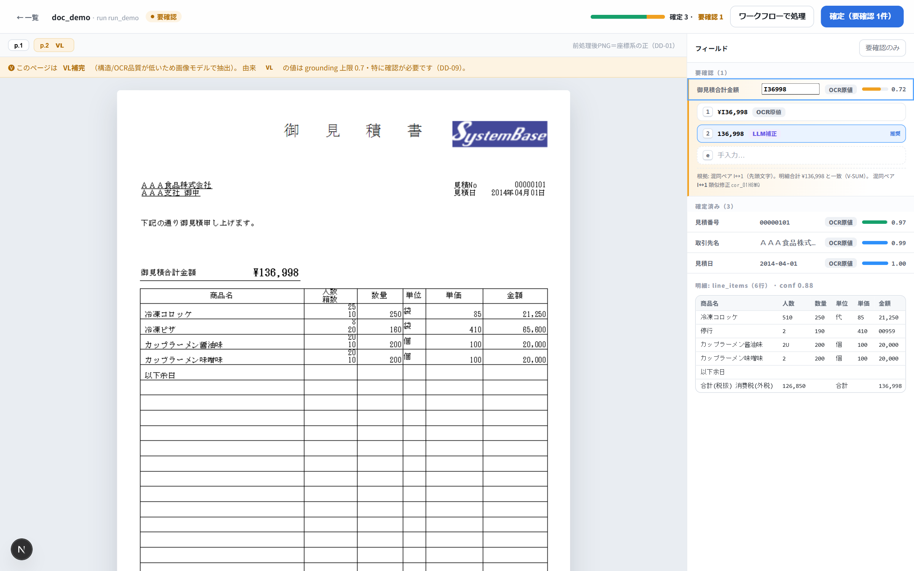

- **画面のポイント**: ① ページタブに「p.2 VL」バッジ ② バナー「このページは **VL補完**（構造/OCR品質が低いため画像モデルで抽出）。由来 VL の値は grounding 上限 0.7・**特に確認が必要です**」 ③ VL 由来の値は**自動確定が禁止**され、必ず人の確認に回る。
- **トーク**: 「読みにくいページを『読めたことにする』のではなく、**読みにくかったと申告して人を呼ぶ**。監査で『この数字の根拠は？』と聞かれたら、帳票画像のこの位置から、この経路で入ったと1画面で示せます」

## 7. 職種別ユースケース（1分・スライド1枚）

- **経理（買掛）**: 請求書 PDF → 登録番号の検査数字・税率別の税額検算まで自動 → 会計システムへ自動転記。見るのは要確認だけ。
- **受発注事務**: 共有フォルダ（Drive／SharePoint／Box）の注文書を自動取込 → 請求書の流れに発注書が混ざったら**分類ゲートが停止** → 受注データとして基幹 DB へ。
- **物流・現場事務**: スキャンした納品書・受領書を取込 → 要確認だけを事務所でまとめて確認。
- **業務改善担当**: 「読む」から「転記」までを絵で組める。画面録画型 RPA の保守地獄からの脱出。

※発表者ノート: スマホ撮影帳票は現行構成では品質担保外（歪み補正が未稼働）— 積極訴求しない。「スキャン画像を推奨。撮影画像は PoC で実測のうえ判断」。

## 8. 体験ワーク（1分＋自習）

1. 手元のダミー帳票をドラッグ＆ドロップ
2. 推定された帳票種別を確認して「抽出を開始」
3. `n` キーで要確認を巡回し、1つ直して `Ctrl+Enter` で確定
4. **直した内容が候補の「根拠」として次の帳票に現れる**ことを後日確認する

**コツ**: ① 欲しい項目が出ないときは、まず**スキーマの項目定義**を疑う ② 直すときは「正しい値」を入れる（後で機械の検証に使われる教師データになる） ③ 迷ったら承認せず要確認のまま残す。

## 9. まとめ — 今日からの使い方（1分・スライド1枚）

**変わること**: テンプレート整備 → **項目名を並べるだけ** ／ 全件目視突合 → **要確認だけ見る** ／ 毎月同じ修正 → **一度直せば、機械が検証してルール化** ／ 転記作業 → **確定した瞬間に基幹へ**。

**今日からのアクション**: ① 「毎月同じ直しをしている」帳票を1種類選ぶ ② その帳票で欲しい項目を書き出す（＝スキーマの種） ③ 体験環境で1枚読ませて、1つ直して、由来バッジを見る。

**問い合わせ先**: （社内窓口を記載）／**利用開始日**: （記載）。

## 10. 現場向け FAQ（配布用）

- **Q. 1枚何秒で読めますか？** → OCR・レイアウト解析は A4 1ページ 12〜16 秒（実測）。項目抽出の AI 時間が加わります。合計時間は御社帳票の PoC で実測してお出しします。
- **Q. 私が直した内容は他社にも共有される？** → いいえ。修正メモリ・ルールは**テナント（会社）単位で完全分離**。修正内容のベクトル化も**自社環境内のローカルモデル**で行い、外部の埋め込み API へ修正データを送りません。
- **Q. うちの帳票が AI の学習に使われる？** → 基盤モデルの追加学習には使いません。学習は御社テナント内の修正メモリとルールだけです。
- **Q. 手書きは読める？** → 印字帳票が主対象。手書きは筆跡差が大きく、実帳票での事前検証（PoC）前提でご案内します。
- **Q. Excel や Word の帳票は？** → 現時点は PDF / PNG / JPEG / TIFF（複数ページ可・50MB／300ページまで）。Office 形式は PDF 化対応を予定（付録A）。
- **Q. 精度は何%？** → **御社の実帳票で測る数字**です。一般論の精度%は提示しません。PoC で実測をお出しします。
- **Q. 間違って確定してしまったら？** → 確定・修正はすべて監査ログに残り、誰がいつどの値をどう変えたかを追跡できます。

---

# 処理の中身 — 1枚の帳票に何が起きているか（技術に興味のある方向け・5分版）

「AI に丸投げ」ではなく、**決定論処理（毎回同じ結果になる処理）で LLM を挟み撃ちにする**パイプライン。§2 の実抽出で実際に走った処理をそのまま説明する。

```
① 取込        ファイル検証（形式/サイズ/ページ数）→ ページ分割・PNG化
② 構造解析     PP-StructureV3 + PP-OCRv6（実測: A4 1ページ 12〜16秒）
              → 読み取り領域(span)・レイアウト・明細表の行×列構造を一括取得
③ 低確信の再読 確信度の低い文字領域だけを切り出して OCR に再問合せ（DD-02）
④ 品質ゲート   ページ品質が基準未満 → 画像AI(VL)補完 or 人の確認へ直行（§6のバナー）
⑤ 過去修正の参照 修正メモリを類似検索（上位5件・類似度0.75以上）→ AIへ渡す
⑥ 項目抽出(KIE) LLM がスキーマの項目を抽出。全項目に読み取り領域IDの紐付けを強制
⑦ 決定論正規化  全半角/和暦→西暦/△▲/桁区切り → テナントの有効ルールを適用
⑧ 確信度算出   min(OCR文字確信度, 根拠の強さ)。根拠なし=0（強制レビュー）
⑨ LLM補正     低確信の項目だけ。混同文字表 or 過去修正例に合致する提案のみ
⑩ 決定論検算   V-SUM/V-TAX/V-QTY/登録番号検査数字/銀行桁数/日付整合
              合格項目は確信度を自動引き上げ（人の確認対象から外す）
⑪ 確信度ゲート  閾値（重要0.90/標準0.80/低0.60）＋無条件レビュー指定で要確認を決定
⑫ 人の確認(HITL) 要確認だけレビューキューへ。確定で ⑬ へ
⑬ 学習        修正を修正メモリへ登録。同種5件でルール抽出→自動検証→有効化
⑭ 確定・出力   DB保存 → ワークフローの下流（DB格納/Webhook/CSV/通知）へ
```

- **LLM を使うのは ⑥ と ⑨ だけ**。しかも ⑨ は低確信項目に限定されるため、LLM コストは「低確信フィールド数 × 補正1回」に収まる（ダッシュボードに Run ごとの実測コスト表示）。
- ②③⑦⑧⑩⑪ はすべて決定論 — 同じ帳票を2回入れれば同じ結果になる。監査説明可能性の土台。
- §3 の「¥I36,998 → 136,998」の提案は、⑨（混同ペア I↔1）＋⑩（明細合計と一致 V-SUM）＋⑤（類似修正 cor_01H8MQ）の**3つの証拠の合流**として画面に表示されていた。

---

# 補足: 管理者向け情報（情シス・業務改善・内部統制の方へ）

## C-1. スキーマ管理（帳票の「型」）

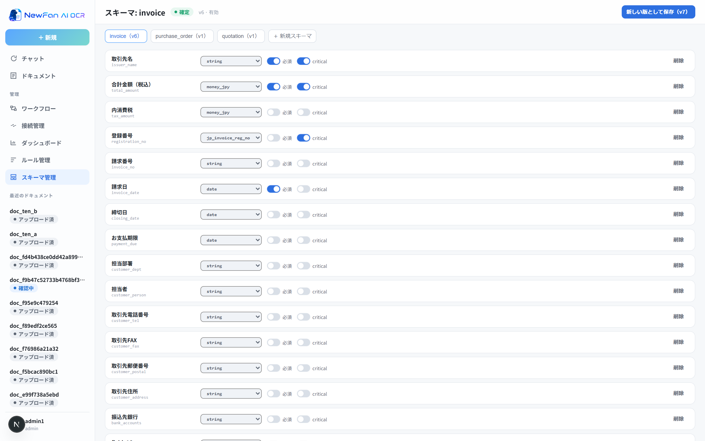

- 帳票種別ごとに項目名・ラベル・型（string／date／money_jpy／jp_invoice_reg_no 等）・必須・**critical**（レビュー閾値を最も厳しくする）をトグルで定義。実機は invoice v6（17項目）・purchase_order v1・quotation v1 の3種が稼働。
- 保存は常に**新版作成**（v6→v7）。実行中のワークフローは開始時点の版を参照し続ける。
- 新規作成モードでは**既存種別との重複を禁止**（暗黙の版バンプ事故を防止）:

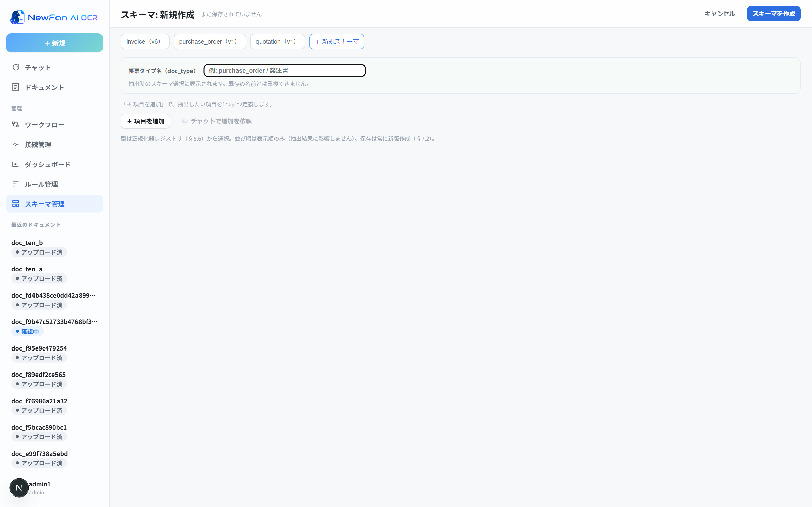

- チャット経由の変更（§2）も**同一の版管理**を通る。AI 提案は人の承認が必須。

## C-2. セキュリティ・テナント分離・監査

- 全業務テーブルに **Row Level Security**。修正メモリのベクトルインデックスもテナント別。埋め込みはローカルモデル（multilingual-e5）— 修正データを外部埋め込み API へ送らない。
- 認証は JWT＋API キー、ロールベース（admin／一般）。管理画面は admin のみ（非 admin は 403）。
- 接続のパスワード・トークン・署名鍵は **DB に保存せず Secrets Manager 参照**（テナント帰属を検証した名前空間限定。接続管理画面にも「秘密は config に書かず secret_ref で渡します」と明記）。
- 監査: 値の修正・確定・スキーマ版作成・ルール有効化/退役/override・ワークフロー変更/有効化/dry-run・接続操作を実施者（human/agent）区別で記録。**「全操作の完全な記録」とは言わない**（表現ルール）。
- Webhook 出力は HMAC-SHA256 署名・5回指数リトライ・SSRF ガード。

## C-3. 基幹 DB 書込みの構造的制約

任意 SQL 不可（プリペアド機械生成のみ）／INSERT・UPSERT のみ／許可テーブル完全一致制／1実行1,000行上限／UPSERT はキー列必須／失敗時ポリシー既定「停止して通知」／顧客側 DB には INSERT/UPSERT 権限のみの専用ユーザーを推奨。§5 の実機画面（設定フォーム・出力プレビュー・SQL 表示）がそのまま監査説明資料になる。

## C-4. 自動化の統制ダイヤル

| パラメータ | 既定 | 意味 |
|---|---|---|
| レビュー閾値 | critical 0.90 / 標準 0.80 / 低影響 0.60 | 項目重要度別の人手確認ライン |
| 無条件レビュー項目 | テナント設定 | 確信度に関わらず必ず人が見る |
| 完全自動化（HITL スキップ） | **既定 OFF** | 有効化しても critical 含む帳票は必ず人の確認（緩和は警告＋監査記録） |
| ルール自動有効化 | 再現率≥90% かつ 回帰0件 | 学習ゲート |
| ルール抽出の起動 | 同種修正5件 | |
| 修正メモリ参照 | 上位5件・類似度≥0.75 | |

確信度 = `min(OCR文字確信度, 根拠の強さ)`。根拠の強さ: 1.00＝帳票文字列と完全一致／0.85＝型変換のみで導出／0.70＝画像AI由来・部分一致／0.00＝根拠なし（強制レビュー）。検算合格で自動引き上げ。

## C-5. 性能・インフラ（実測値のみで話す）

- OCR・レイアウト解析: A4 1ページ **4vCPU=16.4秒／8vCPU=11.6秒**（実測・ウォーム）。精度は構成によらず同一。1ページ単価が vCPU 数によらずほぼ一定 → **タスク数の水平スケールが線形に効く**。
- OCR モデル v5→v6 更改で平均確信度 **0.9127→0.9689**、94行中36行改善。合計・消費税行の取りこぼしは旧モデル起因と実測で特定・解消済み。
- **GPU 不要の構成が既定**（Fargate CPU）。難読帳票が要件未達の場合のみ画像 AI（VL）を GPU 構成で段階追加。
- 障害時: 原本は元ストレージに残り当社は変更しない。ジョブは指数リトライ（既定3回）→恒久失敗は DLQ 隔離。停止中のイベントはキュー滞留→再開後に自動消化（実測: 86秒で消化）。「自動緊急停止」とは言わない（手動手順）。

## C-6. 提供形態 — SaaS 標準＋個社別対応

| 提供形態 | 内容 | 向いているお客様 |
|---|---|---|
| **① SaaS 標準（推奨・最短導入）** | 当社運用のマルチテナント環境。RLS 分離。修正メモリ・ルール・スキーマはテナント内に閉じる | まず効果を確認したい／標準帳票が中心 |
| **② 専用環境提供** | お客様専用テナント／専用インフラ。保持期間・ネットワーク要件・接続先制約に個別対応 | セキュリティ要件が厳しい／自社網内の基幹 DB へ直接書き込みたい |
| **③ カスタマイズ実装 OCR（個社別開発）** | 業務ルールの**専用バリデータ追加**（標準の検算群に追加）／社内コード体系・取引先マスタ名寄せの**正規化器追加**／EDI・業務パッケージへの**専用コネクタ実装**／認識モデルの帳票特化チューニング（適用可否は事前検証）／**オンプレミス・閉域構成**（CPU のみの軽量構成が設計上のオプション） | 標準で吸収しきれない業務ルールがある／データを外に出せない |

**進め方**: ①帳票サンプルの適合性評価 → ②標準／作り込みの切り分け → ③**まず標準 SaaS で PoC（実測値を取る）** → ④必要な作り込みのみ個別見積り。

- **発表者ノート**: 費用は営業窓口から個別案内（利用量計量・上限機能は現状無く「従量課金」の説明もしない）。「どんな帳票でも読める」とは言わない。

---

# 付録A: 表現ルールと「設計 vs 現行実装」差分メモ

## A-1. 言ってはいけない（確定した表現ルール）

一般論の精度数値（帳票精度・STP 率の一般値は**未実測** — 実機ダッシュボードの STP 26.7%/精度 100% は**ローカル検証データ16件の値**であり営業数値に使わない） ／ エンドツーエンドの処理時間の約束（実測は OCR 部のみ） ／ 「登録番号の実在確認」（検査数字の整合まで） ／ 「重複請求を検知します」（V-DUP 未接続） ／ 「何でも読める」 ／ 「テンプレート不要」を「何も登録不要・スキーマも永久に不要」と言い換えること（初回はスキーマ無しで自動発見できるが、安定運用・検算・型正規化はスキーマ化後に効く） ／ 「Word・Excel も読めます」（未実装） ／ 「手書きも読めます」（要事前検証） ／ 「スマホ撮影でも大丈夫」（歪み補正が未稼働） ／ 「メール添付から自動取込」（未実装・画面にも「未実装」表示） ／ 「AI が完全に仕分けます」（分類は決定論キーワードゲート） ／ 「全操作を完全に監査記録」 ／ ダッシュボードの「フィールド精度」を正解率と読み替えること（無修正率） ／ 「1万枚を◯時間で」を実績として ／ 自動緊急停止 ／ 利用量の計量・上限 ／ 「Slack/Teams ネイティブ連携」（Slack 互換 incoming webhook が実体）

## A-2. 現行ビルドとの既知差分（デモ実施者向け）

| 資料の記述（設計・標準機能） | 現行ビルドの状態 |
|---|---|
| 同一請求の重複検知（V-DUP） | 検証ロジック実装済みだが抽出グラフに**未接続**。現行では発火しない |
| 実抽出 Run での bbox ハイライト | 実パイプラインの項目は読み取り領域 ID（span_ids）での紐付けのみで、**bbox 座標の永続化が未配線**。bbox オーバーレイ UI 自体は実装済み（本資料 §3 の該当画面は QA シードデータで撮影 — 付録B） |
| 明細表のセル編集グリッド・行ごとのリアルタイム検算 UI | 未実装（明細の構造抽出・表示・確定データ出力は動作） |
| 修正の記録単位（テキスト領域／表セル） | 現行は項目単位のみ |
| 受理形式に DOCX／XLSX／PPTX | 未実装（E1003 拒否）。現行は PDF / PNG / JPEG / TIFF |
| メール添付トリガー | 未実装（エディタに「未実装」バッジ・有効化不可） |
| Google Drive / M365 / Box 連携 | 実装済み・E2E 実測済み（検証用 fake プロバイダ）。**実クレデンシャルでの OAuth E2E は未了**（対応中） |
| 画像 AI（VL）フォールバック | 既定構成（GPU ゼロ）では無効。品質ゲート NG ページは人の確認へ直行（VL バナー UI は実装済み — §6 画面参照） |
| 前処理（傾き補正・歪み補正） | 本番構成では無効（Noop） |
| ルール関係のグラフ管理（影響範囲照会） | 未実装（Neo4j 部分）。一覧・検証レポート・有効化/退役は実装済み |
| ソフトロック（同時編集の排他） | ロック API は実装済み・UI 表示は簡易 |
| ゴールデンデータセット | 標準帳票での回帰試験は稼働中。100 種への拡張は進行中 |

## A-3. 限定付きで言える表現（確定ルール）

学習 →「修正メモリは1件から効く。恒久ルール化は再現率90%・回帰0件を機械検証してから」 ／ 検算 →「登録番号は検査数字の整合を検証」 ／ 精度 →「御社帳票の PoC 実測でご提示」 ／ 処理時間 →「OCR・レイアウト解析は A4 1ページ 12〜16 秒（実測）。合計は PoC で実測」 ／ DB 連携 →「INSERT/UPSERT のみ・許可テーブル限定・任意 SQL 不可」 ／ 分類 →「許可リスト外の帳票種別を止めるゲート（決定論）」 ／ 個社別対応 →「サンプル評価のうえ標準／作り込みを切り分け」 ／ オンプレ →「CPU のみの軽量構成が設計上のオプション（個社別対応）」

---

# 付録B: 撮影記録（実機・2026-08-21）

- **環境**: ローカル実環境（Docker compose フルスタック）。gateway＋抽出ワーカー＋PP-StructureV3（structure-svc）＋PP-OCRv6（ocr-svc）＋PostgreSQL＋Redis を起動し、Web UI（Next.js）から操作。項目抽出 LLM は Gemini（実 API）。
- **撮影方法**: 実ブラウザ（Chrome・ヘッドレス）を自動操縦し、実操作（アップロード・抽出実行・クリック・フォーム入力・点検・dry-run・チャット送信）を行って撮影。画像はページ領域のみ（1600×1000・1.5x）。
- **データ**: すべて公開サンプル帳票・QA 用ダミーデータ（SystemBase 御見積書サンプル・Pyxis 請求書サンプル等。社名・金額・連絡先はすべて架空／サンプル値）。実顧客データなし。
- **実抽出の証跡**: `images/03`（分類サジェスト）→`images/04`（抽出結果）は、撮影時にその場で実行した実 OCR＋実 LLM 抽出（run_fbab4176）。ワーカーログに structure 呼出し→低確信 crop の /ocr 再問合せ→修正メモリ埋め込み検索→Gemini KIE の全段が記録されている。
- **QA シードで撮影した画面（2枚・明記）**: `images/06`（bbox＋LLM補正候補）と `images/07`（VL補完バナー）は、bbox 永続化未配線・VL 無効の現行実環境では出ない状態を見せるため、**QA シードデータ**（実 PP-StructureV3 の録画 fixture 由来の実座標・実 OCR 誤読値）で撮影。UI は本物・データは QA シード。
- **その他の画面**: すべて実環境 DB の実データ（過去の E2E 実行で蓄積された実 Run・実ワークフロー・実接続）。
- 撮影中に QA 起動スクリプトの陳腐化1件を検出・修正済み（`scripts/serve_gateway_dev.py` のページ画像が旧 data: URI 方式のままで現行の署名付き配信 `/content` と非互換 → storage_root 配下の file:// 方式へ更新）。

| 画像 | 内容 | データ源 |
|---|---|---|
| 01 ドキュメント一覧 | すべて/レビューキュー タブ・状態チップ・取込元表示 | 実環境 |
| 02 レビューキュー | 優先度順の要確認一覧 | 実環境 |
| 03 抽出開始 | 分類サジェスト（推定: quotation 100%・理由付き） | 実環境・実分類 |
| 04 検証画面（実抽出） | その場で実行した実抽出の結果（検算合格・要確認0） | 実環境・実抽出 |
| 05 検証画面（要確認） | 要確認3件・候補採択・確信度バー・明細13行 | 実環境・実抽出（過去Run） |
| 06 bbox＋補正候補 | bbox 色分きオーバーレイ・I↔1 候補・根拠3点 | **QAシード** |
| 07 VL補完バナー | p.2 VL タブ・DD-09 警告バナー | **QAシード** |
| 08 ワークフロー手動実行 | 検証画面からのWF選択・実行 | 実環境 |
| 09/10 スキーマ管理/新規作成 | invoice v6・型/必須/critical・重複禁止 | 実環境 |
| 11 チャット承認カード | スキーマ変更提案→承認して実行/今回はしない | 実環境・実チャット |
| 12/13 ルール管理/LLM最適化 | llm_hint 有効/承認待ち・日本語ヒント入力 | 実環境 |
| 14 ダッシュボード | STP/無修正率/LLM実測コスト/学習ファネル | 実環境（検証データ16件） |
| 15 ワークフローエディタ | active v3・DB格納設定・点検OKトースト | 実環境 |
| 16 点検エラー | lint エラー2件・赤ハイライト | 実環境（検証用に作成した壊れた図） |
| 17 出力プレビュー | dry-run・列/値の対応・SQL表示 | 実環境 |
| 18 接続管理 | 4種の接続・最終同期✓/✗・今すぐ同期 | 実環境 |
| 19 チャットホーム | サジェストチップ・ファイル添付 | 実環境 |
| 20 ワークフロー一覧 | active 3本・draft の版表示 | 実環境 |

---

# 付録C: 用語

| 用語 | 意味 |
|---|---|
| **スキーマ** | 帳票種別ごとの「取りたい項目の定義」。テンプレート（座標登録）ではない。版管理される。初回はスキーマ無しの自動発見抽出から**テンプレート化**で作れる（ADR-0006） |
| **テンプレートレス** | 取引先ごとのレイアウト登録（座標指定）を必要としない方式。項目定義は必要 |
| **HITL** | Human In The Loop。機械が自信を持てない箇所だけを人が確認する運用 |
| **確信度（confidence）** | 値の確からしさ。OCR の文字確信度と根拠の強さの小さい方 |
| **根拠（grounding）** | 抽出値が帳票画像上のどの読み取り領域から来たかの紐付け。根拠なしの値は自動確定不可 |
| **修正メモリ** | 人が直した内容をテナント別に蓄積し、次回の抽出で参照する仕組み。1件から効く |
| **ルール** | 修正メモリから抽出され、機械検証（再現率90%・回帰0件）を通って恒久適用される変換規則。決定論4種＋LLM最適化1種 |
| **決定論（deterministic）** | AI 推論を使わず、同じ入力に常に同じ結果を返す処理。正規化・検算・分類ゲートが該当 |
| **auto-elevation** | 検算に合格した項目の確信度を自動で引き上げ、人の確認対象から外す仕組み |
| **dry-run** | ワークフローを出力なしで実行し、生成される SQL／ペイロードをプレビューすること。有効化の前提条件 |
| **VL補完** | 品質の低いページを画像モデルで補う経路。由来 VL の値は自動確定禁止（要人手確認） |
| **STP 率** | 人が一切触らずに完了した帳票の割合 |

---

**改稿履歴**: v1.0（2026-08-21）初版（2部構成） → v2.0（同日）敵対的レビュー反映・現場向け単部構成へ再編 → **v3.0（同日）全画面を実機撮影に置換**（実環境フルスタックで実抽出を実行。QA シード使用2枚は付録Bに明記）。「処理の中身」章を追加。
